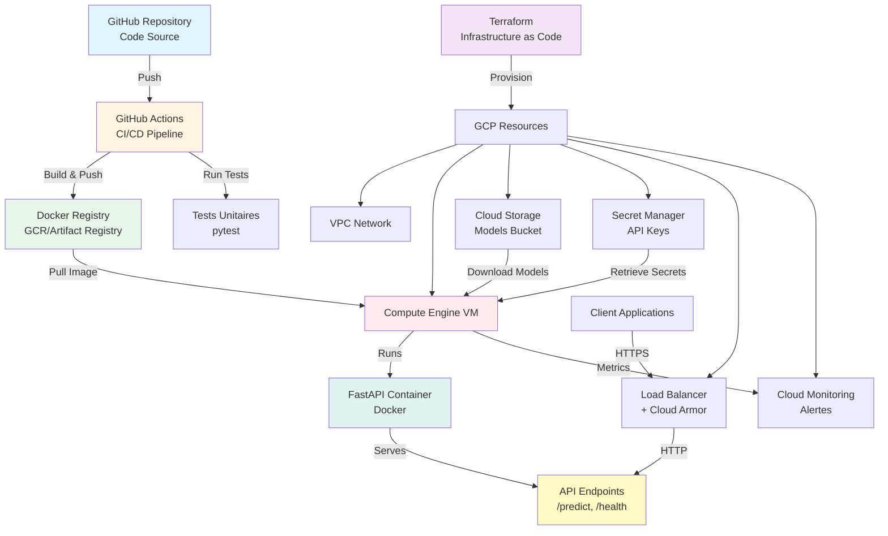

# 🚀 MLOps Core - Pipeline End-to-End

Automatisation du cycle: Orchestration, CI/CD, et Observalité du modèle en production.

## 📋 Vue d'ensemble

**Projet** : Automatisation complète du cycle de vie ML - Orchestration, CI/CD, et Observalité en production

Ce projet couvre les piliers essentiels du MLOps :
- **🔄 Orchestration** : Infrastructure as Code (Terraform), déploiement automatisé, gestion des ressources GCP
- **⚙️ CI/CD** : Pipeline GitHub Actions pour build, test et déploiement automatique
- **📊 Observalité** : Monitoring avec alertes Cloud Monitoring, logging structuré, health checks
- **🔬 Expérimentation** : MLflow pour le tracking des expériences ML
- **📦 Versioning** : DVC pour le versioning des données et la reproductibilité

**Technologies** : Python, FastAPI, MLflow, DVC, Docker, Terraform, GCP, GitHub Actions  
**Statut** : ✅ Prêt pour la production

## ✨ Fonctionnalités

- 🔐 **Authentification API** : API keys avec Secret Manager GCP (création via Terraform)
- 🛡️ **Sécurité renforcée** : Rate limiting, firewall restrictif, moindre privilège IAM
- 🔒 **Chiffrement KMS** : Support Customer-Managed Encryption Keys pour le bucket GCS
- ⚖️ **Load Balancer** : Load Balancer HTTP avec Cloud Armor pour protection DDoS
- 📊 **Monitoring** : Alertes Cloud Monitoring (CPU, mémoire, instance down)
- 🚀 **Déploiement automatisé** : Infrastructure as Code avec Terraform
- 🐳 **Containerisation** : Docker multi-stage optimisé
- 🔄 **CI/CD** : GitHub Actions pour build/test/push automatique
- 📊 **MLflow Tracking** : Tracking complet des expériences ML (paramètres, métriques, modèles)
- 🔄 **DVC Pipeline** : Versioning des données et pipeline reproductible

## 🏗️ Architecture



## 🚀 Démarrage rapide

### Prérequis

- Python 3.11+
- Docker & Docker Compose
- Terraform >= 1.0
- Google Cloud SDK (pour le déploiement)

### Installation locale

```bash
# Cloner le repository
git clone https://github.com/mlarnes/mlops-core
cd mlops-core

# Installation automatique
make install

# Entraîner le modèle
make train

# Lancer l'API en développement
make run
```

L'API sera disponible sur http://localhost:8000

### Déploiement sur GCP

Voir la [documentation complète de déploiement](./docs/SEMAINE_3.md) pour les instructions détaillées.

**Résumé** :
1. Configurer `terraform/terraform.tfvars` (voir `terraform/terraform.tfvars.example`)
2. Optionnel : Créer le secret API_KEY via Terraform (`create_secret_manager_secret = true`)
3. Uploader le script de déploiement dans GCS
4. `terraform apply`

**Fonctionnalités optionnelles** :
- Load Balancer avec Cloud Armor (`enable_load_balancer = true`)
- Chiffrement KMS (`enable_kms_encryption = true`)
- Monitoring avec alertes (`enable_monitoring_alerts = true`)

## 📡 API Endpoints

| Endpoint | Méthode | Auth | Description |
|----------|---------|------|-------------|
| `/` | GET | ❌ | Informations API |
| `/health` | GET | ❌ | Health check |
| `/predict` | POST | ✅ | Prédiction iris (rate limit: 10/min) |
| `/model/info` | GET | ✅ | Informations modèle (rate limit: 20/min) |
| `/docs` | GET | ❌ | Documentation Swagger |

### Exemple d'utilisation

```bash
# Health check
curl http://localhost:8000/health

# Prédiction (avec API key)
curl -X POST "http://localhost:8000/predict" \
  -H "Content-Type: application/json" \
  -H "X-API-Key: your-api-key" \
  -d '{
    "sepal_length": 5.1,
    "sepal_width": 3.5,
    "petal_length": 1.4,
    "petal_width": 0.2
  }'
```

## 🛠️ Commandes principales

### Développement
```bash
make install      # Installation complète
make train        # Entraîner le modèle
make test         # Exécuter les tests
make lint         # Vérifier la qualité du code
make format       # Formater le code
make run          # Lancer l'API (dev)
make build        # Build Docker
```

### MLflow
```bash
make mlflow-ui           # Lancer l'interface MLflow (http://localhost:5000)
make mlflow-experiments  # Lister les expériences
```

### DVC
```bash
make dvc-init      # Initialiser DVC
make dvc-repro     # Réexécuter le pipeline complet
make dvc-status    # Vérifier l'état du pipeline
make dvc-pipeline  # Visualiser le pipeline
```

### Aide
```bash
make help          # Voir toutes les commandes disponibles
```

## 🔒 Sécurité

- ✅ **Authentification** : API keys via Secret Manager (création via Terraform)
- ✅ **Rate limiting** : Protection contre abus (10-30 req/min selon endpoint)
- ✅ **Firewall** : Deny by default, accès restreint par IP
- ✅ **IAM** : Principe du moindre privilège
- ✅ **Secrets** : Aucun secret hardcodé, gestion via Secret Manager
- ✅ **Chiffrement** : Support KMS pour Customer-Managed Encryption Keys
- ✅ **Load Balancer** : Cloud Armor pour protection DDoS (optionnel)
- ✅ **Logging** : Audit complet des accès
- ✅ **Monitoring** : Alertes sur CPU, mémoire, instance down

## 📚 Documentation

- 📖 [Semaine 1 : Docker & FastAPI](./docs/SEMAINE_1.md) - ✅ Terminé
- 📖 [Semaine 2 : CI/CD GitHub Actions](./docs/SEMAINE_2.md) - ✅ Terminé
- 📖 [Semaine 3 : Infrastructure Terraform & Déploiement](./docs/SEMAINE_3.md) - ✅ Terminé
- 📖 [Semaine 4 : MLOps local (MLflow + DVC)](./docs/SEMAINE_4.md) - ✅ Terminé

## 🏗️ Structure du projet

```
mlops-core/
├── src/                    # Code source
│   ├── config.py         # Configuration centralisée (Pydantic)
│   ├── data/             # Préparation des données
│   ├── models/            # Définitions des modèles
│   ├── training/          # Entraînement des modèles
│   ├── evaluation/        # Évaluation des modèles
│   └── serving/           # API de prédiction (FastAPI)
├── tests/                  # Tests unitaires
├── scripts/                # Scripts utilitaires & déploiement
├── terraform/              # Infrastructure as Code
├── docs/                   # Documentation détaillée
├── data/                   # Données versionnées (DVC)
│   ├── raw/               # Dataset brut
│   └── processed/         # Données traitées
├── models/                 # Modèles ML (gitignored)
├── mlruns/                 # MLflow tracking (gitignored)
├── params.yaml            # Paramètres du pipeline (DVC)
├── dvc.yaml               # Pipeline DVC
└── .dvc/                   # Configuration DVC
```

## 🔗 Ressources

### Documentation
- [Documentation API](http://localhost:8000/docs)
- [Guide de déploiement complet](./docs/SEMAINE_3.md)
- [Guide MLflow & DVC](./docs/SEMAINE_4.md)

### Technologies
- [FastAPI Documentation](https://fastapi.tiangolo.com/)
- [Terraform GCP Provider](https://registry.terraform.io/providers/hashicorp/google/latest)
- [MLflow Documentation](https://mlflow.org/docs/latest/index.html)
- [DVC Documentation](https://dvc.org/doc)

## 📝 Licence

Formation MLOps - Projet éducatif

---

**Status** : ✅ Production-ready | **Version** : 1.0.0
