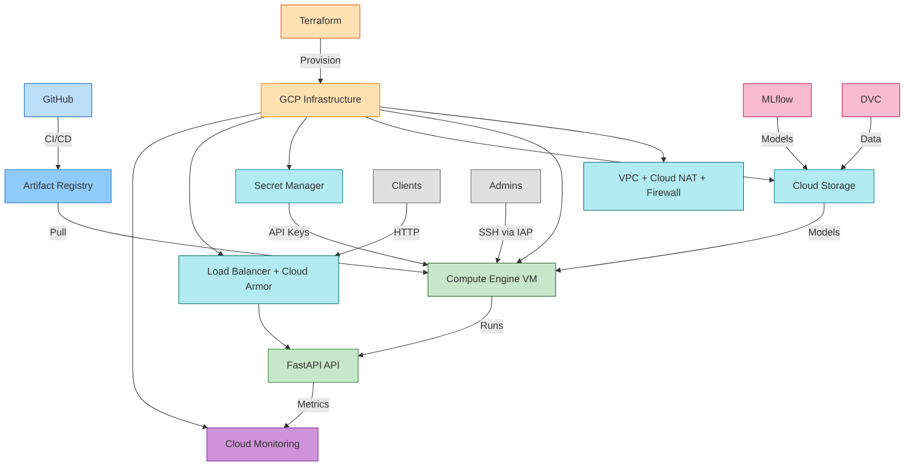

# 🚀 MLOps Core - Pipeline End-to-End

> Automatisation complète du cycle de vie ML : Orchestration, CI/CD, et Observabilité en production.

[](https://www.python.org/)
[](https://fastapi.tiangolo.com/)
[](LICENSE)
[]()

**Technologies** : Python, FastAPI, MLflow, DVC, Docker, Kubernetes, Terraform, GCP  
**Version** : 1.0.0

---

## 📑 Table des matières

- [🚀 Quick Start](#-quick-start)
- [📋 Vue d'ensemble](#-vue-densemble)
- [✨ Fonctionnalités](#-fonctionnalités)
- [📚 Phases MLOps du Projet](#-phases-mlops-du-projet)
- [🏗️ Architecture](#️-architecture)
- [📦 Installation](#-installation)
- [🎯 Utilisation](#-utilisation)
- [☁️ Déploiement GCP](#️-déploiement-gcp)
- [☸️ Déploiement Kubernetes](#️-déploiement-kubernetes)
- [📡 API Endpoints](#-api-endpoints)
- [⚙️ Configuration](#️-configuration)
- [🛠️ Commandes](#️-commandes)
- [🔒 Sécurité](#-sécurité)
- [🔍 Troubleshooting](#-troubleshooting)
- [📚 Documentation](#-documentation)
- [🏗️ Structure du projet](#️-structure-du-projet)

---

## 🚀 Quick Start

```bash
# Cloner et installer
git clone https://github.com/mlarnes/mlops-core
cd mlops-core
make install

# Entraîner le modèle
make train

# Lancer l'API (dans un terminal)
make run

# Tester (dans un autre terminal)
curl http://localhost:8000/health
```

> **💡 Documentation interactive** : http://localhost:8000/docs

---

## 📋 Vue d'ensemble

Ce projet implémente un **cycle MLOps complet** en 5 phases progressives :

1. **🟢 Phase 1 : Serving & Containerisation** - API FastAPI + Docker
2. **🟢 Phase 2 : CI/CD** - Automatisation avec GitHub Actions
3. **🟢 Phase 3 : Infrastructure** - Infrastructure as Code avec Terraform
4. **🟡 Phase 4 : Expérimentation** - Tracking MLflow + Versioning DVC
5. **🟣 Phase 5 : Orchestration** - Kubernetes avec auto-scaling
6. **🔵 Phase 6 : Observabilité** - Monitoring & Logging (à venir)

Chaque phase est documentée dans [`docs/PHASE_X.md`](docs/) avec des guides complets, exemples et bonnes pratiques.

👉 **Voir [Phases MLOps du Projet](#-phases-mlops-du-projet) pour plus de détails**

## ✨ Fonctionnalités

- 🔐 **Authentification** : API keys via Secret Manager GCP
- 🛡️ **Sécurité** : Rate limiting, firewall restrictif, headers de sécurité
- 🔒 **Chiffrement** : Support KMS pour Customer-Managed Encryption Keys
- ⚖️ **Load Balancer** : HTTP avec Cloud Armor (optionnel)
- 📊 **Monitoring** : Alertes Cloud Monitoring, métriques Prometheus
- 🚀 **Déploiement** : Infrastructure as Code avec Terraform
- 🐳 **Containerisation** : Docker multi-stage optimisé
- ☸️ **Orchestration** : Kubernetes avec auto-scaling (HPA) et haute disponibilité
- 📊 **MLflow** : Tracking complet des expériences ML
- 🔄 **DVC** : Versioning des données et pipeline reproductible

## 📚 Phases MLOps du Projet

Ce projet suit une progression en 5 phases couvrant le cycle MLOps complet :

| Phase | Focus Principal | Technologies | Documentation |
|------|-----------------|--------------|---------------|
| **1. Serving & Containerisation** | API FastAPI + Docker | FastAPI, Docker, pytest | [📖 Phase 1](docs/PHASE_1.md) |
| **2. CI/CD** | Automatisation | GitHub Actions, Artifact Registry | [📖 Phase 2](docs/PHASE_2.md) |
| **3. Infrastructure** | Infrastructure as Code | Terraform, GCP | [📖 Phase 3](docs/PHASE_3.md) |
| **4. Expérimentation** | Tracking & Versioning | MLflow, DVC | [📖 Phase 4](docs/PHASE_4.md) |
| **5. Orchestration** | Container Orchestration | Kubernetes, HPA | [📖 Phase 5](docs/PHASE_5.md) |
| **6. Observabilité** | Monitoring & Logging | Prometheus, Grafana, Cloud Monitoring | 🔜 À venir |

### 🎯 Vue d'ensemble par Phase

#### Phase 1 : Serving & Containerisation
- ✅ **Serving** : API FastAPI pour l'inférence ML
- ✅ **Containerisation** : Docker multi-stage optimisé
- ✅ **Tests** : Tests unitaires et d'intégration
- 📖 [Documentation complète](docs/PHASE_1.md)

#### Phase 2 : CI/CD
- ✅ **GitHub Actions** : Pipeline automatisé (build, test, push)
- ✅ **Artifact Registry** : Stockage des images Docker
- ✅ **Automation** : Déploiement automatisé
- 📖 [Documentation complète](docs/PHASE_2.md)

#### Phase 3 : Infrastructure as Code
- ✅ **Terraform** : Provisioning automatique GCP
- ✅ **Infrastructure** : VPC, VM, Load Balancer, Cloud Storage
- ✅ **Sécurité** : Secret Manager, Firewall, Cloud Armor
- 📖 [Documentation complète](docs/PHASE_3.md)

#### Phase 4 : Expérimentation & Versioning
- ✅ **MLflow** : Tracking des expériences ML
- ✅ **DVC** : Versioning des données et pipelines
- ✅ **Reproductibilité** : Pipeline ML complet
- 📖 [Documentation complète](docs/PHASE_4.md)

#### Phase 5 : Orchestration
- ✅ **Kubernetes** : Orchestration des applications
- ✅ **Auto-scaling** : HPA (Horizontal Pod Autoscaler)
- ✅ **Haute disponibilité** : Multi-replicas, health checks
- 📖 [Documentation complète](docs/PHASE_5.md)

#### Phase 6 : Observabilité (À venir)
- ⚠️ **Prometheus** : Collecte de métriques applicatives
- ⚠️ **Grafana** : Dashboards et visualisation
- ⚠️ **Cloud Monitoring** : Monitoring infrastructure (partiellement implémenté)
- ⚠️ **Logging** : Logs structurés et centralisés

## 🏗️ Architecture



**Composants** : GitHub Actions → Artifact Registry → GCP (VPC, VM/K8s, Storage, Secret Manager, Load Balancer) → FastAPI | MLflow/DVC → Cloud Storage | Monitoring

## 📦 Installation

### Prérequis

| Outil | Version |
|-------|---------|
| **Python** | 3.11+ |
| **Docker** | >= 20.10 |
| **Docker Compose** | >= 2.0 |
| **Terraform** | >= 1.0 |
| **Google Cloud SDK** | >= 400.0 |
| **Poetry** | >= 1.7.0 |
| **kubectl** | >= 1.28 (optionnel, pour Kubernetes) |
| **minikube** ou **kind** | >= 1.30 / >= 0.20 (optionnel, pour Kubernetes local) |

### Installation Locale

```bash
git clone https://github.com/mlarnes/mlops-core
cd mlops-core
make install
```

> **Note** : L'installation configure automatiquement Poetry et installe toutes les dépendances.

---

## 🎯 Utilisation

### Entraîner le Modèle

```bash
# Entraîner avec les paramètres par défaut
make train

# Ou exécuter le pipeline DVC complet
make dvc-repro

# Visualiser les résultats dans MLflow
make mlflow-ui  # http://localhost:5000
```

#### Expérimenter avec différents paramètres

```bash
# Option 1 : Modifier params.yaml puis réexécuter
make dvc-repro

# Option 2 : Surcharger directement (sans modifier params.yaml)
poetry run dvc exp run -S train.n_estimators=200 -S train.max_depth=10

# Visualiser et comparer dans MLflow
make mlflow-ui  # http://localhost:5000
```

### Tester l'API Localement

```bash
# Lancer l'API
make run

# Tests (dans un autre terminal)
curl http://localhost:8000/health

# Prédiction (API key optionnelle en dev)
curl -X POST "http://localhost:8000/predict" \
  -H "Content-Type: application/json" \
  -H "X-API-Key: your-api-key" \
  -d '{"sepal_length": 5.1, "sepal_width": 3.5, "petal_length": 1.4, "petal_width": 0.2}'
```

> **💡 Astuce** : Documentation interactive disponible sur http://localhost:8000/docs

### Lancer l'API avec Docker Compose

```bash
# Entraîner le modèle d'abord
make train

# Lancer le conteneur (monte automatiquement mlruns/)
docker compose up
```

## ☁️ Déploiement GCP

### Préparation

```bash
# Variables d'environnement
export PROJECT_ID="your-project-id"
export DOCKER_IMAGE_URI="europe-west1-docker.pkg.dev/$PROJECT_ID/mlops-repo/iris-api:latest"
export REGION="europe-west1"

# Authentification
gcloud auth login
gcloud auth application-default login
gcloud config set project $PROJECT_ID

# Activer les APIs nécessaires
gcloud services enable \
  compute.googleapis.com \
  storage-component.googleapis.com \
  iam.googleapis.com \
  secretmanager.googleapis.com \
  artifactregistry.googleapis.com \
  monitoring.googleapis.com \
  logging.googleapis.com \
  iap.googleapis.com
```

### Build et Push de l'Image Docker

```bash
# Créer le repository Artifact Registry
gcloud artifacts repositories create mlops-repo \
  --repository-format=docker \
  --location=$REGION \
  --description="MLOps API Docker repository" \
  --project=$PROJECT_ID || true

# Configurer Docker
gcloud auth configure-docker $REGION-docker.pkg.dev

# Builder l'image Docker (linux/amd64 - compatible partout : GCP, Mac M1/M2 via Rosetta, etc.)
docker build --platform linux/amd64 -t $DOCKER_IMAGE_URI .

# Pusher l'image vers Artifact Registry
docker push $DOCKER_IMAGE_URI
```

> **💡 Note** : `linux/amd64` fonctionne partout : GCP, AWS, Azure, et même sur Mac M1/M2 via émulation Rosetta (transparent avec Docker).

### Configuration Terraform

```bash
# Créer le bucket pour le state Terraform
gcloud storage buckets create gs://$PROJECT_ID-terraform-state \
  --project=$PROJECT_ID --location=$REGION || true

# Copier les fichiers d'exemple
cp terraform/backend.tf.example terraform/backend.tf
cp terraform/terraform.tfvars.example terraform/terraform.tfvars

# Générer l'API key
export TF_VAR_api_key_value=$(openssl rand -hex 32)
```

**Configuration de `backend.tf`** : Remplacez le nom du bucket par `$PROJECT_ID-terraform-state`.

**Configuration minimale dans `terraform.tfvars`** :
```hcl
project_id = "your-project-id"
iap_tunnel_users = ["votre-email@example.com"]
docker_image = "europe-west1-docker.pkg.dev/$PROJECT_ID/mlops-repo/iris-api:latest"
secret_manager_api_key_name = "mlops-api-key"
```

**⚠️ Deux scénarios de sécurité** :

**Scénario 1 : Load Balancer (RECOMMANDÉ)**
```hcl
enable_load_balancer = true
enable_public_ip = false
allowed_http_ips = ["130.211.0.0/22", "35.191.0.0/16"]  # Plages IP Load Balancers GCP
allowed_ssh_ips = []  # SSH via IAP uniquement
```
→ Accès HTTP via Load Balancer, SSH via IAP

**Scénario 2 : IP publique sur la VM**
```hcl
enable_load_balancer = false
enable_public_ip = true
MY_IP=$(curl -s https://checkip.amazonaws.com)
allowed_ssh_ips = ["${MY_IP}/32"]
allowed_http_ips = ["${MY_IP}/32"]
```
→ Accès direct à l'IP publique de la VM (moins sécurisé)

Consultez `terraform.tfvars.example` pour toutes les options disponibles.

### Déploiement

```bash
# Déployer l'infrastructure
make terraform-init
make terraform-plan
make terraform-apply

# Uploader le modèle vers GCS
BUCKET_NAME=$(terraform -chdir=terraform output -raw bucket_name)
gcloud storage cp -r mlruns/ gs://$BUCKET_NAME/
```

### Démarrer l'API

```bash
# Récupérer les informations de déploiement
VM_NAME=$(terraform -chdir=terraform output -raw vm_name)
ZONE=$(terraform -chdir=terraform output -raw vm_zone)

# Se connecter à la VM via IAP et démarrer le service
gcloud compute ssh $VM_NAME\
  --zone=$ZONE \
  --project=$PROJECT_ID \
  --tunnel-through-iap \
  --command="sudo systemctl start mlops-api && sudo systemctl status mlops-api"
```

### Tester en Production

```bash
# Récupérer l'API key
SECRET_NAME=$(terraform -chdir=terraform output -raw secret_manager_secret_name)
API_KEY=$(gcloud secrets versions access latest --secret="$SECRET_NAME" --project=$PROJECT_ID)

# Utiliser le Load Balancer (ou l'IP de la VM en fallback)
API_IP=$(terraform -chdir=terraform output -raw load_balancer_ip 2>/dev/null || terraform -chdir=terraform output -raw vm_external_ip)

# Tests
curl http://$API_IP/health
curl -X POST "http://$API_IP/predict" \
  -H "Content-Type: application/json" \
  -H "X-API-Key: $API_KEY" \
  -d '{"sepal_length": 5.1, "sepal_width": 3.5, "petal_length": 1.4, "petal_width": 0.2}'
```

> **📚 Guide détaillé** : Consultez [`docs/PHASE_3.md`](./docs/PHASE_3.md) pour plus d'informations sur le déploiement GCP.

## ☸️ Déploiement Kubernetes

### Préparation

```bash
# Installer minikube ou kind
make k8s-setup
# ou
make k8s-setup-kind

# Préparer les secrets
cp k8s/secret.yaml.example k8s/secret.yaml
# Éditer k8s/secret.yaml avec vos valeurs
```

### Déploiement

```bash
# Déployer l'application
make k8s-deploy

# Vérifier le statut
make k8s-status

# Accéder à l'API (port-forward)
make k8s-port-forward
# Dans un autre terminal
curl http://localhost:8000/health
```

### Tests

```bash
# Tester l'API
make k8s-test

# Voir les logs
make k8s-logs

# Vérifier le scaling
kubectl get pods -n mlops
```

> **📚 Guide détaillé** : Consultez [`docs/PHASE_5.md`](./docs/PHASE_5.md) pour plus d'informations sur Kubernetes.

## 📡 API Endpoints

| Endpoint | Méthode | Auth | Rate Limit | Description |
|----------|---------|------|------------|-------------|
| `/` | GET | ❌ | - | Informations API |
| `/health` | GET | ❌ | 30/min | Health check |
| `/metrics` | GET | ❌ | - | Métriques Prometheus |
| `/predict` | POST | ✅ | 10/min | Prédiction iris |
| `/model/info` | GET | ✅ | 20/min | Informations modèle |
| `/docs` | GET | ❌ | - | Documentation Swagger |

## ⚙️ Configuration

### Variables d'Environnement

| Variable | Description | Défaut | Production |
|----------|-------------|--------|------------|
| `ENVIRONMENT` | `development` / `production` | `development` | `production` |
| `API_KEY` | Clé API (générer avec `openssl rand -hex 32`) | - | **Requis** |
| `CORS_ORIGINS` | Origines autorisées (séparées par `,`) | `*` (dev uniquement) | **Spécifique, jamais `*`** |
| `LOG_LEVEL` | `DEBUG` / `INFO` / `WARNING` / `ERROR` | `INFO` | `INFO` |
| `MODEL_DIR` | Répertoire des modèles | `models` | `models` |
| `MLFLOW_TRACKING_URI` | URI MLflow (GCS ou serveur) | - | `gs://bucket/mlruns/` |

> **⚠️ Sécurité** : En production, `CORS_ORIGINS` doit être spécifique (ex: `https://example.com`).  
> L'application refusera de démarrer si `ENVIRONMENT=production` et que `CORS_ORIGINS` est vide ou contient `*` (protection volontaire contre un CORS trop permissif).

### Configuration du Modèle

Le pipeline ML est configuré via `params.yaml` :

```yaml
data:
  test_size: 0.2
  random_state: 42

train:
  n_estimators: 200
  max_depth: 10
```

> **💡 Astuce** : Modifier ces valeurs puis exécuter `make dvc-repro` pour réentraîner le modèle avec les nouveaux paramètres.

## 🛠️ Commandes

### Développement

| Commande | Description |
|----------|-------------|
| `make install` | Installation complète (Poetry + dépendances) |
| `make train` | Entraîner le modèle ML |
| `make test` | Exécuter tous les tests |
| `make lint` | Vérifier la qualité du code |
| `make format` | Formater le code (Black + isort) |
| `make run` | Lancer l'API en développement |
| `make build` | Construire l'image Docker |

### MLflow & DVC

| Commande | Description |
|----------|-------------|
| `make mlflow-ui` | Lancer l'interface MLflow (http://localhost:5000) |
| `make dvc-init` | Initialiser DVC |
| `make dvc-repro` | Réexécuter le pipeline DVC |
| `make dvc-status` | Vérifier l'état du pipeline |
| `make dvc-push` | Pousser les données versionnées |
| `make dvc-pull` | Télécharger les données versionnées |

### Terraform

| Commande | Description |
|----------|-------------|
| `make terraform-init` | Initialiser Terraform |
| `make terraform-plan` | Planifier les changements |
| `make terraform-apply` | Déployer l'infrastructure |
| `make terraform-destroy` | Détruire l'infrastructure |
| `make terraform-output` | Afficher les outputs |

### Kubernetes

| Commande | Description |
|----------|-------------|
| `make k8s-setup` | Installer minikube et créer le cluster |
| `make k8s-setup-kind` | Installer kind et créer le cluster |
| `make k8s-deploy` | Déployer l'API sur Kubernetes |
| `make k8s-status` | Vérifier le statut du déploiement |
| `make k8s-logs` | Voir les logs des pods |
| `make k8s-port-forward` | Port-forward vers l'API |
| `make k8s-test` | Tester l'API déployée |
| `make k8s-delete` | Supprimer le déploiement |
| `make k8s-clean` | Nettoyer complètement |

### Aide

```bash
make help  # Liste complète des commandes disponibles
```

> **💡 Astuce** : Toutes les commandes `make` peuvent être exécutées depuis la racine du projet.

## 📦 Configuration Avancée

### DVC Remote (GCS)

Pour versionner les données dans Google Cloud Storage :

```bash
# Créer le bucket DVC (si PROJECT_ID est défini)
gcloud storage buckets create gs://$PROJECT_ID-dvc-cache \
  --project=$PROJECT_ID --location=europe-west1 || true

# Configurer DVC
dvc remote add -d gcs gs://$PROJECT_ID-dvc-cache
export GOOGLE_APPLICATION_CREDENTIALS=/path/to/key.json

# Utilisation
make dvc-push    # Pousser les données
make dvc-pull    # Télécharger les données
```

## 🔒 Sécurité

### Authentification & Autorisation
- ✅ **API Keys** : Authentification via Secret Manager GCP
- ✅ **IAM** : Principe du moindre privilège
- ✅ **Secrets** : Aucun secret hardcodé, gestion centralisée via Secret Manager

### Protection
- ✅ **Rate Limiting** : Protection contre abus (10-30 req/min selon endpoint)
- ✅ **Firewall** : Deny by default, accès restreint par IP
- ✅ **Cloud NAT** : Accès Internet sortant uniquement (unidirectionnel) - n'expose pas la VM aux connexions entrantes
- ✅ **HTTPS/TLS** : Certificats Let's Encrypt (production)
- ✅ **Load Balancer** : Cloud Armor pour protection DDoS (optionnel)

### Observabilité & Conformité
- ✅ **Logging structuré** : Logs JSON pour audit
- ✅ **Monitoring** : Alertes Cloud Monitoring activées
- ✅ **Métriques** : Prometheus pour observabilité
- ✅ **Scan de vulnérabilités** : Automatisé dans CI/CD

### Chiffrement
- ✅ **KMS** : Support Customer-Managed Encryption Keys

## 🔍 Troubleshooting

### ⚡ Vérifications Rapides

Avant de chercher plus loin, vérifiez ces points communs :

```bash
# 1. Vérifier que l'API répond
curl http://localhost:8000/health  # Local
curl http://$API_IP/health         # Production

# 2. Vérifier les logs (choisir selon votre environnement)
docker compose logs iris-api                    # Local Docker
sudo journalctl -u mlops-api -f                 # Production VM
docker logs iris-api                            # Production container

# 3. Vérifier que le modèle est entraîné
cat models/metadata.json | grep mlflow_run_id

# 4. Vérifier les variables d'environnement
docker compose config                           # Local
sudo systemctl show mlops-api | grep -E "API_KEY|MLFLOW"  # Production
```

---

### 🐳 Problèmes Docker / Artifact Registry

#### ❌ "Unauthenticated request" lors du pull Docker

**Quick fix** :
```bash
# Réappliquer les permissions IAM
cd terraform
terraform apply -target=google_project_iam_member.artifact_registry_reader
```

**Vérifications détaillées** :
```bash
# 1. Vérifier les permissions IAM
gcloud projects get-iam-policy $PROJECT_ID \
  --flatten="bindings[].members" \
  --filter="bindings.members:serviceAccount:mlops-api-sa@$PROJECT_ID.iam.gserviceaccount.com"

# 2. Vérifier les scopes de la VM
ZONE=$(terraform -chdir=terraform output -raw vm_zone)
gcloud compute instances describe iris-api-server \
  --zone=$ZONE --project=$PROJECT_ID \
  --format="get(serviceAccounts[].scopes)"

# 3. Vérifier les logs du script de démarrage
gcloud compute ssh iris-api-server --zone=$ZONE --project=$PROJECT_ID --tunnel-through-iap \
  --command="sudo cat /var/log/startup.log | tail -50"
```

---

### 🚀 Problèmes API

#### ❌ L'API ne démarre pas

**Quick fix** :
```bash
# Vérifier les logs pour identifier l'erreur
docker compose logs iris-api  # Local
sudo journalctl -u mlops-api -n 50  # Production
```

**Solutions courantes** :
- **Modèle manquant** : Vérifier `models/metadata.json` contient `mlflow_run_id`
- **MLflow URI incorrect** : Vérifier `MLFLOW_TRACKING_URI` et upload vers GCS
- **API_KEY manquante** : Vérifier Secret Manager et permissions

#### ❌ Erreur CORS

**Quick fix** :
```bash
# Configurer CORS_ORIGINS (ne jamais utiliser "*" en production)
export CORS_ORIGINS=https://votre-domaine.com
# Redémarrer l'API
```

#### ❌ Modèle non trouvé (503)

**Quick fix** :
```bash
# 1. Vérifier l'upload vers GCS
BUCKET_NAME=$(terraform -chdir=terraform output -raw bucket_name)
gcloud storage ls gs://$BUCKET_NAME/mlruns/

# 2. Vérifier metadata.json
cat models/metadata.json | grep mlflow_run_id

# 3. Réuploader si nécessaire
gcloud storage cp -r mlruns/ gs://$BUCKET_NAME/
```

---

### 🏗️ Problèmes Terraform

#### ❌ Erreurs d'authentification

**Quick fix** :
```bash
gcloud auth application-default login
gcloud config set project $PROJECT_ID
```

#### ❌ Erreurs de permissions

**Quick fix** :
```bash
# Vérifier les rôles requis
gcloud projects get-iam-policy $PROJECT_ID

# Rôles nécessaires : Compute Admin, Storage Admin, Secret Manager Admin
```

#### ❌ "API not enabled"

**Quick fix** :
```bash
gcloud services enable compute.googleapis.com storage-component.googleapis.com \
  iam.googleapis.com secretmanager.googleapis.com artifactregistry.googleapis.com \
  monitoring.googleapis.com logging.googleapis.com iap.googleapis.com
```

---

### 🖥️ Problèmes VM / Service

#### ❌ Service systemd n'existe pas

**Symptôme** : `Failed to start mlops-api.service: Unit mlops-api.service not found`

**Quick fix** :
```bash
# 1. Vérifier les logs du script de démarrage
ZONE=$(terraform -chdir=terraform output -raw vm_zone)
gcloud compute ssh iris-api-server --zone=$ZONE --project=$PROJECT_ID --tunnel-through-iap \
  --command="sudo cat /var/log/startup.log | tail -100"

# 2. Si "Network is unreachable" → Cloud NAT manquant
cd terraform && terraform apply && gcloud compute instances reset iris-api-server --zone=$ZONE

# 3. Redémarrer la VM pour relancer le script
gcloud compute instances reset iris-api-server --zone=$ZONE --project=$PROJECT_ID
```

**Solution manuelle** (si le script a échoué) :
```bash
# Se connecter à la VM
gcloud compute ssh iris-api-server --zone=$ZONE --project=$PROJECT_ID --tunnel-through-iap

# Le script de démarrage devrait créer le service automatiquement
# Si nécessaire, voir la documentation complète dans docs/PHASE_3.md
```

---

### 📋 Checklist de Diagnostic

Si le problème persiste, vérifiez dans l'ordre :

- [ ] **Authentification** : `gcloud auth application-default login`
- [ ] **Projet** : `gcloud config get-value project`
- [ ] **APIs activées** : Toutes les APIs GCP nécessaires sont activées
- [ ] **Permissions IAM** : Service account a les rôles requis
- [ ] **Modèle entraîné** : `models/metadata.json` existe avec `mlflow_run_id`
- [ ] **Upload GCS** : `mlruns/` uploadé vers GCS
- [ ] **Variables d'environnement** : `API_KEY`, `MLFLOW_TRACKING_URI` configurées
- [ ] **Logs** : Vérifier les logs pour erreurs spécifiques
- [ ] **Réseau** : Cloud NAT configuré si VM sans IP publique
- [ ] **Firewall** : Règles firewall autorisent le trafic

---

> **💡 Besoin d'aide ?** Consultez [`docs/PHASE_3.md`](./docs/PHASE_3.md) pour un guide de dépannage plus détaillé.

## 🏗️ Structure du projet

```
mlops-core/
├── src/                    # Code source Python
│   ├── config.py          # Configuration centralisée (Pydantic)
│   ├── data/              # Préparation des données
│   │   └── prepare.py
│   ├── training/          # Entraînement des modèles
│   │   └── train.py
│   ├── evaluation/        # Évaluation des modèles
│   │   └── evaluate.py
│   └── serving/           # API de prédiction (FastAPI)
│       ├── app.py         # Application principale
│       ├── routes.py     # Endpoints API
│       ├── models.py      # Modèles Pydantic
│       └── security.py    # Authentification
├── tests/                  # Tests unitaires (pytest)
├── scripts/                # Scripts utilitaires & déploiement
├── terraform/              # Infrastructure as Code (GCP)
├── k8s/                    # Manifests Kubernetes
│   ├── namespace.yaml     # Namespace
│   ├── deployment.yaml    # Deployment
│   ├── service.yaml       # Service
│   ├── configmap.yaml     # ConfigMap
│   ├── secret.yaml.example # Template Secret
│   ├── ingress.yaml       # Ingress (optionnel)
│   └── hpa.yaml           # HPA (optionnel)
├── docs/                   # Documentation détaillée
├── data/                   # Données versionnées (DVC)
│   ├── raw/               # Dataset brut
│   └── processed/         # Données traitées
├── models/                 # Métadonnées du modèle
│   ├── metadata.json      # Métadonnées (inclut mlflow_run_id)
│   └── metrics.json       # Métriques d'évaluation
├── mlruns/                 # MLflow tracking (gitignored)
├── params.yaml            # Paramètres du pipeline (DVC)
├── dvc.yaml               # Pipeline DVC
├── pyproject.toml         # Configuration Poetry
├── Dockerfile             # Image Docker
└── docker-compose.yml     # Configuration Docker Compose
```

## 📚 Documentation

### Documentation par Phase

| Phase | Documentation | Statut |
|------|---------------|--------|
| **1. Serving & Containerisation** | [📖 Phase 1](docs/PHASE_1.md) | ✅ Complète |
| **2. CI/CD** | [📖 Phase 2](docs/PHASE_2.md) | ✅ Complète |
| **3. Infrastructure** | [📖 Phase 3](docs/PHASE_3.md) | ✅ Complète |
| **4. Expérimentation** | [📖 Phase 4](docs/PHASE_4.md) | ✅ Complète |
| **5. Orchestration** | [📖 Phase 5](docs/PHASE_5.md) | ✅ Complète |
| **6. Observabilité** | 🔜 À venir | ⚠️ Partiel |

### Guides Rapides

- [🚀 Quick Start](#-quick-start)
- [☁️ Déploiement GCP](docs/PHASE_3.md#-déploiement-sur-gcp)
- [☸️ Déploiement Kubernetes](docs/PHASE_5.md#-guide-de-déploiement)
- [🔧 Configuration](#️-configuration)
- [🛠️ Commandes](#️-commandes)

### Documentation API

- **Swagger UI** : http://localhost:8000/docs (en développement)
- **ReDoc** : http://localhost:8000/redoc

### Ressources Externes

| Technologie | Documentation |
|-------------|---------------|
| **FastAPI** | [fastapi.tiangolo.com](https://fastapi.tiangolo.com/) |
| **Docker** | [docs.docker.com](https://docs.docker.com/) |
| **Terraform GCP** | [registry.terraform.io](https://registry.terraform.io/providers/hashicorp/google/latest) |
| **MLflow** | [mlflow.org](https://mlflow.org/docs/latest/index.html) |
| **DVC** | [dvc.org](https://dvc.org/doc) |
| **Kubernetes** | [kubernetes.io](https://kubernetes.io/docs/) |

---

## 📝 Licence

Formation MLOps - Projet éducatif

---

<div align="center">

**Status** : ✅ Production-ready | **Version** : 1.0.0

</div>
