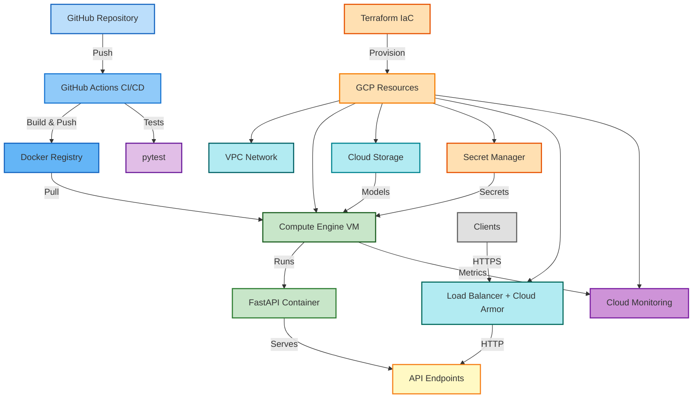

# 🚀 MLOps Core - Pipeline End-to-End

Automatisation complète du cycle de vie ML : Orchestration, CI/CD, et Observabilité en production.

**Technologies** : Python, FastAPI, MLflow, DVC, Docker, Terraform, GCP  
**Statut** : ✅ Production Ready (v1.0.0)

## 📋 Vue d'ensemble

Ce projet couvre les piliers essentiels du MLOps :
- **🔄 Orchestration** : Infrastructure as Code (Terraform), déploiement automatisé
- **⚙️ CI/CD** : Pipeline GitHub Actions pour build/test/déploiement
- **📊 Observabilité** : Monitoring Cloud Monitoring, logging structuré, Prometheus
- **🔬 Expérimentation** : MLflow pour le tracking des expériences ML
- **📦 Versioning** : DVC pour le versioning des données et reproductibilité

## ✨ Fonctionnalités

- 🔐 **Authentification** : API keys via Secret Manager GCP
- 🛡️ **Sécurité** : Rate limiting, firewall restrictif, headers de sécurité
- 🔒 **Chiffrement** : Support KMS pour Customer-Managed Encryption Keys
- ⚖️ **Load Balancer** : HTTP avec Cloud Armor (optionnel)
- 📊 **Monitoring** : Alertes Cloud Monitoring, métriques Prometheus
- 🚀 **Déploiement** : Infrastructure as Code avec Terraform
- 🐳 **Containerisation** : Docker multi-stage optimisé
- 📊 **MLflow** : Tracking complet des expériences ML
- 🔄 **DVC** : Versioning des données et pipeline reproductible

## 🏗️ Architecture



## 🚀 Guide Complet - Étape par Étape

### Prérequis

- **Python** : 3.11+ (testé avec 3.11.0, 3.11.5, 3.12.0)
- **Docker** : >= 20.10 (testé avec 20.10, 24.0)
- **Docker Compose** : >= 2.0 (plugin) ou docker-compose >= 1.29 (standalone)
- **Terraform** : >= 1.0 (testé avec 1.5.0, 1.6.0)
- **Google Cloud SDK** : >= 400.0 (pour le déploiement)
- **Poetry** : >= 1.7.0 (gestionnaire de dépendances)

### Étape 1 : Installation Locale

```bash
git clone https://github.com/mlarnes/mlops-core
cd mlops-core

make install    # Installation complète
```

### Étape 2 : Entraîner le Modèle

```bash
# Entraîner le modèle avec les paramètres par défaut
make train

# Ou exécuter le pipeline DVC complet
make dvc-repro

# Visualiser les résultats dans MLflow
make mlflow-ui
# Ouvrir http://localhost:5000
```

**Expérimenter avec différents paramètres** :
```bash
# Créer une branche pour une expérience
git checkout -b experiment/high-n-estimators

# Modifier params.yaml puis réexécuter
make dvc-repro

# Ou surcharger directement sans modifier params.yaml
dvc repro -S train.n_estimators=200 -S train.max_depth=10

# Comparer les résultats dans MLflow
make mlflow-ui

# Commit si résultats intéressants
git add params.yaml dvc.lock models/metadata.json models/metrics.json
git commit -m "Experiment: n_estimators=200"
```

### Étape 3 : Tester l'API Localement

```bash
# Lancer l'API en local
make run

# Tester l'API
curl http://localhost:8000/health

# Faire une prédiction (API key dans .env)
curl -X POST "http://localhost:8000/predict" \
  -H "Content-Type: application/json" \
  -H "X-API-Key: your-api-key" \
  -d '{
    "sepal_length": 5.1,
    "sepal_width": 3.5,
    "petal_length": 1.4,
    "petal_width": 0.2
  }'
```

### Étape 4 : Déployer sur GCP

#### 4.1 Configuration GCP

```bash
# ⚠️ IMPORTANT : Définir votre PROJECT_ID une seule fois au début
# Remplacez "your-project-id" par votre ID de projet GCP réel
export PROJECT_ID="your-project-id"

# 1. Authentification (OBLIGATOIRE en premier)
gcloud auth login

# 2. Créer le projet GCP (si pas déjà créé)
# Par défaut, les projets sont créés via la console GCP : https://console.cloud.google.com/
# Ou via la commande :
gcloud projects create $PROJECT_ID --name="MLOps Core" || true

# 3. Configurer le projet GCP (après création)
gcloud config set project $PROJECT_ID

# 4. Authentification pour Terraform (application-default)
gcloud auth application-default login
```

#### 4.2 Activer les APIs GCP

```bash
# Activer toutes les APIs nécessaires
gcloud services enable \
  compute.googleapis.com \
  storage-component.googleapis.com \
  iam.googleapis.com \
  secretmanager.googleapis.com \
  artifactregistry.googleapis.com \
  monitoring.googleapis.com \
  logging.googleapis.com

# Vérifier que les APIs sont activées
gcloud services list --enabled
```

#### 4.3 Builder et Pusher l'Image Docker

```bash
# Builder l'image Docker localement
docker build -t iris-api:latest .

# Créer un repository Artifact Registry
gcloud artifacts repositories create mlops-repo \
  --repository-format=docker \
  --location=europe-west1 \
  --description="MLOps API Docker repository" \
  --project=$PROJECT_ID || true

# Configurer Docker pour Artifact Registry
gcloud auth configure-docker europe-west1-docker.pkg.dev

# Tagger l'image
docker tag iris-api:latest europe-west1-docker.pkg.dev/$PROJECT_ID/mlops-repo/iris-api:latest

# Pusher vers Artifact Registry
docker push europe-west1-docker.pkg.dev/$PROJECT_ID/mlops-repo/iris-api:latest

# Vérifier
gcloud artifacts docker images list europe-west1-docker.pkg.dev/$PROJECT_ID/mlops-repo
```

**⚠️ Important** : Notez l'URI complète de l'image (ex: `europe-west1-docker.pkg.dev/$PROJECT_ID/mlops-repo/iris-api:latest`). Vous en aurez besoin pour `docker_image` dans `terraform.tfvars`.

#### 4.4 Créer le Backend Terraform

```bash
# Créer le bucket pour le state Terraform
gcloud storage buckets create gs://$PROJECT_ID-terraform-state \
  --project=$PROJECT_ID --location=europe-west1 || true

# Configurer backend
cd terraform
cp backend.tf.example backend.tf
# Éditer backend.tf avec vos valeurs
terraform init
```

#### 4.5 Configurer Terraform

```bash
# Copier et éditer terraform.tfvars
cp terraform.tfvars.example terraform.tfvars
```

**À modifier dans `terraform.tfvars`** :
- `project_id` : Remplacez par la valeur de `$PROJECT_ID` (ex: `"your-project-id"`)
- `allowed_ssh_ips` : Votre IP publique (`curl ifconfig.me`)
- `docker_image` : `"europe-west1-docker.pkg.dev/$PROJECT_ID/mlops-repo/iris-api:latest"` (remplacer `$PROJECT_ID` par la valeur réelle)
- `secret_manager_api_key_name` : Nom du secret (ex: `"mlops-api-key"`)

**💡 Astuce** : Vous pouvez utiliser `echo $PROJECT_ID` pour afficher la valeur et la copier dans `terraform.tfvars`.

**Puis exporter l'API key** :
```bash
export TF_VAR_api_key_value=$(openssl rand -hex 32)
```

**📋 Voir `terraform/terraform.tfvars.example` pour toutes les options**

#### 4.6 Déployer l'Infrastructure

```bash
# Valider et planifier
terraform validate
terraform plan

# Déployer (créer VM, bucket, secrets, etc.)
terraform apply
```

#### 4.7 Uploader le Modèle et les Métadonnées

```bash
# Récupérer le nom du bucket créé par Terraform
BUCKET_NAME=$(terraform output -raw bucket_name)

# Revenir à la racine du projet pour les uploads
cd ..

# Uploader mlruns/ vers GCS (nécessaire pour charger le modèle)
# L'API utilise runs:/<run_id>/model qui est résolu vers GCS via MLFLOW_TRACKING_URI
gcloud storage cp -r mlruns/ gs://$BUCKET_NAME/mlruns/

# Note: models/metadata.json et models/metrics.json sont inclus dans l'image Docker
# Ils sont versionnés avec Git via DVC et n'ont pas besoin d'être uploadés séparément

# Vérifier
gcloud storage ls gs://$BUCKET_NAME/
gcloud storage ls gs://$BUCKET_NAME/mlruns/
```

#### 4.8 Uploader le Script de Déploiement

```bash
# Depuis le répertoire terraform
cd terraform

# Récupérer les outputs Terraform
BUCKET_NAME=$(terraform output -raw bucket_name)
VM_NAME=$(terraform output -raw vm_name)
VM_ZONE=$(terraform output -raw vm_zone)

# Revenir à la racine du projet pour l'upload
cd ..

# Uploader le script de déploiement
gcloud storage cp scripts/deploy-api.sh gs://$BUCKET_NAME/scripts/deploy-api.sh

# Redémarrer la VM pour déclencher le script de déploiement
gcloud compute instances reset $VM_NAME --zone=$VM_ZONE
```

#### 4.9 Tester l'API en Production

```bash
# Depuis le répertoire terraform
cd terraform

# Récupérer l'IP de la VM
VM_IP=$(terraform output -raw vm_external_ip)

# Récupérer l'API key depuis Secret Manager (ou utiliser celle exportée en 4.5)
# Note: Si PROJECT_ID n'est plus défini dans ce shell, le récupérer depuis Terraform :
# PROJECT_ID=$(terraform output -raw project_id)
API_KEY=$(gcloud secrets versions access latest --secret="mlops-api-key" --project=$PROJECT_ID)

# Tester le health check
curl http://$VM_IP:8000/health

# Faire une prédiction
curl -X POST "http://$VM_IP:8000/predict" \
  -H "Content-Type: application/json" \
  -H "X-API-Key: $API_KEY" \
  -d '{
    "sepal_length": 5.1,
    "sepal_width": 3.5,
    "petal_length": 1.4,
    "petal_width": 0.2
  }'
```

**Note** : 
- Les fichiers `models/metadata.json` et `models/metrics.json` sont inclus dans l'image Docker (versionnés avec Git via DVC)
- Le modèle est chargé dynamiquement depuis GCS via MLflow en utilisant `mlflow_run_id` depuis `metadata.json`
- MLflow télécharge temporairement le modèle dans son cache (`~/.mlflow/cache`) lors du chargement
- `MLFLOW_TRACKING_URI` est configuré automatiquement par Terraform à partir du nom du bucket (`gs://$BUCKET_NAME/mlruns/`)

## 📡 API Endpoints

| Endpoint | Méthode | Auth | Rate Limit | Description |
|----------|---------|------|------------|-------------|
| `/` | GET | ❌ | - | Informations API |
| `/health` | GET | ❌ | 30/min | Health check |
| `/metrics` | GET | ❌ | - | Métriques Prometheus |
| `/predict` | POST | ✅ | 10/min | Prédiction iris |
| `/model/info` | GET | ✅ | 20/min | Informations modèle |
| `/docs` | GET | ❌ | - | Documentation Swagger |

## ⚙️ Configuration

### Variables d'Environnement

| Variable | Description | Défaut | Production |
|----------|-------------|--------|------------|
| `ENVIRONMENT` | development/production | `development` | `production` |
| `API_KEY` | Clé API (`openssl rand -hex 32`) | - | **Requis** |
| `CORS_ORIGINS` | Origines autorisées (séparées par `,`) | `*` | **Spécifique** |
| `LOG_LEVEL` | DEBUG/INFO/WARNING/ERROR | `INFO` | `INFO` |
| `MODEL_DIR` | Répertoire des modèles | `models` | `models` |
| `MLFLOW_TRACKING_URI` | URI MLflow (GCS ou serveur) | - | `gs://bucket/mlruns/` |

**⚠️ CORS_ORIGINS** : Domaine du frontend qui appelle l'API. Exemple : `https://example.com`  
**Production** : Ne pas utiliser `*`

### Configuration du Modèle

Le projet utilise `params.yaml` pour la configuration du pipeline ML :

```yaml
data:
  test_size: 0.2
  random_state: 42

train:
  n_estimators: 100
  max_depth: null
```

## 🛠️ Commandes Principales

```bash
# Développement
make install      # Installation complète
make train        # Entraîner le modèle
make test         # Exécuter les tests
make lint         # Vérifier la qualité du code
make format       # Formater le code
make run          # Lancer l'API (dev)
make build        # Build Docker

# MLflow
make mlflow-ui           # Interface MLflow (http://localhost:5000)

# DVC
make dvc-init      # Initialiser DVC
make dvc-repro     # Réexécuter le pipeline
make dvc-status    # Vérifier l'état
make dvc-push      # Pousser les données
make dvc-pull      # Télécharger les données

# Terraform
make terraform-init      # Initialiser
make terraform-plan      # Planifier
make terraform-apply     # Déployer
make terraform-destroy   # Détruire
make terraform-output    # Afficher les outputs

# Aide
make help          # Voir toutes les commandes
```

## 📦 Configuration Avancée

### DVC Remote (GCS)

```bash
# Créer le bucket
gcloud storage buckets create gs://$PROJECT_ID-dvc-cache \
  --project=$PROJECT_ID --location=europe-west1 || true

# Configurer DVC
dvc remote add -d gcs gs://$PROJECT_ID-dvc-cache
export GOOGLE_APPLICATION_CREDENTIALS=/path/to/key.json

# Utiliser
dvc push    # Pousser les données
dvc pull    # Télécharger les données
```

## 🔒 Sécurité

- ✅ **Authentification** : API keys via Secret Manager
- ✅ **Rate limiting** : Protection contre abus (10-30 req/min selon endpoint)
- ✅ **HTTPS/TLS** : Certificats Let's Encrypt (production)
- ✅ **Scan de vulnérabilités** : Automatisé dans CI/CD
- ✅ **Firewall** : Deny by default, accès restreint par IP
- ✅ **IAM** : Principe du moindre privilège
- ✅ **Secrets** : Aucun secret hardcodé, gestion via Secret Manager
- ✅ **Chiffrement** : Support KMS pour Customer-Managed Encryption Keys
- ✅ **Load Balancer** : Cloud Armor pour protection DDoS (optionnel)
- ✅ **Logging structuré** : Logs JSON pour audit
- ✅ **Monitoring** : Alertes Cloud Monitoring activées
- ✅ **Métriques** : Prometheus pour observabilité

## 🔍 Troubleshooting

### L'API ne démarre pas

```bash
# Vérifier les métadonnées (doit contenir mlflow_run_id)
ls models/metadata.json
cat models/metadata.json | grep mlflow_run_id

# Vérifier les logs
docker-compose logs iris-api

# Vérifier les variables d'environnement
docker-compose config

# Le modèle est chargé depuis MLflow via runs:/<run_id>/model
```

### Erreur CORS en production

```bash
echo $CORS_ORIGINS                    # Vérifier CORS_ORIGINS
export CORS_ORIGINS=https://example.com  # Ne pas utiliser "*"
```

### Terraform échoue

```bash
gcloud auth application-default login  # Vérifier credentials
gcloud config get-value project       # Vérifier le projet
gcloud projects get-iam-policy $PROJECT_ID  # Vérifier permissions
```

## 🏗️ Structure du projet

```
mlops-core/
├── src/                    # Code source
│   ├── config.py         # Configuration centralisée (Pydantic)
│   ├── data/             # Préparation des données
│   ├── training/          # Entraînement des modèles
│   ├── evaluation/        # Évaluation des modèles
│   └── serving/           # API de prédiction (FastAPI)
├── tests/                  # Tests unitaires
├── scripts/                # Scripts utilitaires & déploiement
├── terraform/              # Infrastructure as Code
├── docs/                   # Documentation détaillée
├── data/                   # Données versionnées (DVC)
│   ├── raw/               # Dataset brut
│   └── processed/         # Données traitées
├── models/                 # Métadonnées du modèle (metadata.json, metrics.json)
├── mlruns/                 # MLflow tracking (gitignored)
├── params.yaml            # Paramètres du pipeline (DVC)
└── dvc.yaml               # Pipeline DVC
```

## 🔗 Ressources

### Documentation
- [Documentation API - Swagger UI interactive](http://localhost:8000/docs)
- [Semaine 1 - Introduction et setup](./docs/SEMAINE_1.md)
- [Semaine 2 - CI/CD avec GitHub Actions](./docs/SEMAINE_2.md)
- [Semaine 3 - Déploiement](./docs/SEMAINE_3.md)
- [Semaine 4 - MLflow & DVC](./docs/SEMAINE_4.md)

### Technologies
- [FastAPI Documentation](https://fastapi.tiangolo.com/)
- [Terraform GCP Provider](https://registry.terraform.io/providers/hashicorp/google/latest)
- [MLflow Documentation](https://mlflow.org/docs/latest/index.html)
- [DVC Documentation](https://dvc.org/doc)

## 📝 Licence

Formation MLOps - Projet éducatif

---

**Status** : ✅ Production-ready | **Version** : 1.0.0
