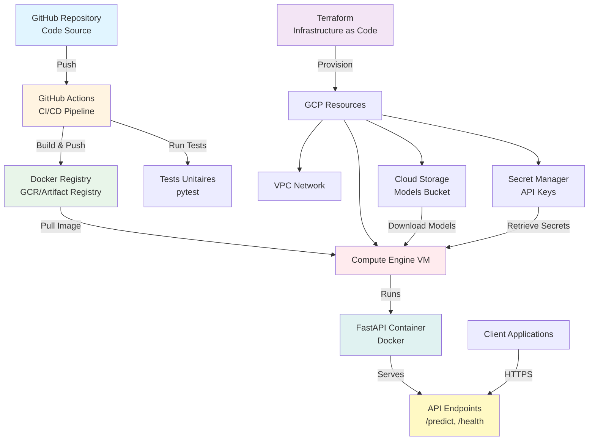

# 🚀 MLOps Core - Pipeline End-to-End

Pipeline MLOps complet : De l'entraînement (MLflow) au déploiement (Terraform/GCP) avec versioning DVC et pipeline CI/CD.

## 📋 Vue d'ensemble

**Projet** : Pipeline MLOps end-to-end de l'entraînement au déploiement en production  
**Technologies** : Python, FastAPI, MLflow, DVC, Docker, Terraform, GCP, GitHub Actions  
**Statut** : ✅ Prêt pour la production

## ✨ Fonctionnalités

- 🔐 **Authentification API** : API keys avec Secret Manager GCP
- 🛡️ **Sécurité renforcée** : Rate limiting, firewall restrictif, moindre privilège IAM
- 🚀 **Déploiement automatisé** : Infrastructure as Code avec Terraform
- 🐳 **Containerisation** : Docker multi-stage optimisé
- 🔄 **CI/CD** : GitHub Actions pour build/test/push automatique
- 📊 **Monitoring** : Health checks, logging structuré

## 🏗️ Architecture



## 🚀 Démarrage rapide

### Prérequis

- Python 3.11+
- Docker & Docker Compose
- Terraform >= 1.0
- Google Cloud SDK (pour le déploiement)

### Installation locale

```bash
# Cloner le repository
git clone https://github.com/mlarnes/mlops-core
cd mlops-core

# Installation automatique
make install

# Entraîner le modèle
make train

# Lancer l'API en développement
make run
```

L'API sera disponible sur http://localhost:8000

### Déploiement sur GCP

Voir la [documentation complète de déploiement](./docs/SEMAINE_3.md) pour les instructions détaillées.

**Résumé** :
1. Configurer `terraform/terraform.tfvars`
2. Créer le secret API_KEY dans Secret Manager
3. Uploader le script de déploiement dans GCS
4. `terraform apply`

## 📡 API Endpoints

| Endpoint | Méthode | Auth | Description |
|----------|---------|------|-------------|
| `/` | GET | ❌ | Informations API |
| `/health` | GET | ❌ | Health check |
| `/predict` | POST | ✅ | Prédiction iris (rate limit: 10/min) |
| `/model/info` | GET | ✅ | Informations modèle (rate limit: 20/min) |
| `/docs` | GET | ❌ | Documentation Swagger |

### Exemple d'utilisation

```bash
# Health check
curl http://localhost:8000/health

# Prédiction (avec API key)
curl -X POST "http://localhost:8000/predict" \
  -H "Content-Type: application/json" \
  -H "X-API-Key: your-api-key" \
  -d '{
    "sepal_length": 5.1,
    "sepal_width": 3.5,
    "petal_length": 1.4,
    "petal_width": 0.2
  }'
```

## 🛠️ Commandes principales

```bash
make install      # Installation complète
make train        # Entraîner le modèle
make test         # Exécuter les tests
make lint         # Vérifier la qualité du code
make format       # Formater le code
make run          # Lancer l'API (dev)
make build        # Build Docker
make help         # Voir toutes les commandes
```

## 🔒 Sécurité

- ✅ **Authentification** : API keys via Secret Manager
- ✅ **Rate limiting** : Protection contre abus (10-30 req/min selon endpoint)
- ✅ **Firewall** : Deny by default, accès restreint par IP
- ✅ **IAM** : Principe du moindre privilège
- ✅ **Secrets** : Aucun secret hardcodé, gestion via Secret Manager
- ✅ **Logging** : Audit complet des accès

## 📚 Documentation

- 📖 [Semaine 1 : Docker & FastAPI](./docs/SEMAINE_1.md) - ✅ Terminé
- 📖 [Semaine 2 : CI/CD GitHub Actions](./docs/SEMAINE_2.md) - ✅ Terminé
- 📖 [Semaine 3 : Infrastructure Terraform & Déploiement](./docs/SEMAINE_3.md) - ✅ Terminé
- 📖 [Semaine 4 : MLOps local (MLflow + DVC)](./docs/SEMAINE_4.md) - 📋 Planifié

## 🏗️ Structure du projet

```
mlops-core/
├── src/                    # Code source
│   ├── application/        # API FastAPI
│   └── core/              # Scripts d'entraînement
├── tests/                  # Tests unitaires
├── scripts/                # Scripts utilitaires & déploiement
├── terraform/              # Infrastructure as Code
├── docs/                   # Documentation détaillée
└── models/                 # Modèles ML (gitignored)
```

## 🔗 Ressources

- [Documentation API](http://localhost:8000/docs)
- [Guide de déploiement complet](./docs/SEMAINE_3.md)
- [FastAPI Documentation](https://fastapi.tiangolo.com/)
- [Terraform GCP Provider](https://registry.terraform.io/providers/hashicorp/google/latest)

## 📝 Licence

Formation MLOps - Projet éducatif

---

**Status** : ✅ Production-ready | **Version** : 1.0.0
