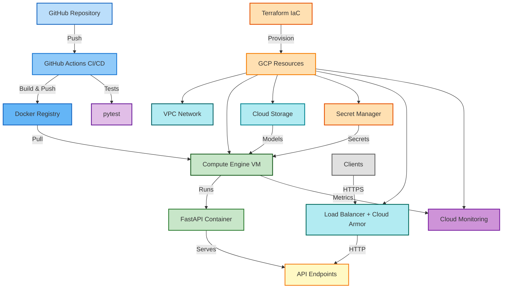

# 🚀 MLOps Core - Pipeline End-to-End

> Automatisation complète du cycle de vie ML : Orchestration, CI/CD, et Observabilité en production.

[](https://www.python.org/)
[](https://fastapi.tiangolo.com/)
[](LICENSE)
[]()

**Technologies** : Python, FastAPI, MLflow, DVC, Docker, Terraform, GCP  
**Version** : 1.0.0

---

## 📑 Table des matières

- [🚀 Quick Start](#-quick-start)
- [📋 Vue d'ensemble](#-vue-densemble)
- [✨ Fonctionnalités](#-fonctionnalités)
- [🏗️ Architecture](#️-architecture)
- [📦 Installation](#-installation)
- [🎯 Utilisation](#-utilisation)
- [☁️ Déploiement GCP](#️-déploiement-gcp)
- [📡 API Endpoints](#-api-endpoints)
- [⚙️ Configuration](#️-configuration)
- [🛠️ Commandes](#️-commandes)
- [🔒 Sécurité](#-sécurité)
- [🔍 Troubleshooting](#-troubleshooting)
- [📚 Documentation](#-documentation)
- [🏗️ Structure du projet](#️-structure-du-projet)

---

## 🚀 Quick Start

```bash
# Cloner et installer
git clone https://github.com/mlarnes/mlops-core
cd mlops-core
make install

# Entraîner le modèle
make train

# Lancer l'API (dans un terminal)
make run

# Tester (dans un autre terminal)
curl http://localhost:8000/health
```

> **💡 Documentation interactive** : http://localhost:8000/docs

---

## 📋 Vue d'ensemble

Ce projet couvre les piliers essentiels du MLOps :
- **🔄 Orchestration** : Infrastructure as Code (Terraform), déploiement automatisé
- **⚙️ CI/CD** : Pipeline GitHub Actions pour build/test/déploiement
- **📊 Observabilité** : Monitoring Cloud Monitoring, logging structuré, Prometheus
- **🔬 Expérimentation** : MLflow pour le tracking des expériences ML
- **📦 Versioning** : DVC pour le versioning des données et reproductibilité

## ✨ Fonctionnalités

- 🔐 **Authentification** : API keys via Secret Manager GCP
- 🛡️ **Sécurité** : Rate limiting, firewall restrictif, headers de sécurité
- 🔒 **Chiffrement** : Support KMS pour Customer-Managed Encryption Keys
- ⚖️ **Load Balancer** : HTTP avec Cloud Armor (optionnel)
- 📊 **Monitoring** : Alertes Cloud Monitoring, métriques Prometheus
- 🚀 **Déploiement** : Infrastructure as Code avec Terraform
- 🐳 **Containerisation** : Docker multi-stage optimisé
- 📊 **MLflow** : Tracking complet des expériences ML
- 🔄 **DVC** : Versioning des données et pipeline reproductible

## 🏗️ Architecture



## 📦 Installation

### Prérequis

| Outil | Version | Notes |
|-------|---------|-------|
| **Python** | 3.11+ | Testé avec 3.11.0, 3.11.5, 3.12.0 |
| **Docker** | >= 20.10 | Testé avec 20.10, 24.0 |
| **Docker Compose** | >= 2.0 | Plugin ou standalone >= 1.29 |
| **Terraform** | >= 1.0 | Testé avec 1.5.0, 1.6.0 |
| **Google Cloud SDK** | >= 400.0 | Pour le déploiement GCP |
| **Poetry** | >= 1.7.0 | Gestionnaire de dépendances |

### Installation Locale

```bash
git clone https://github.com/mlarnes/mlops-core
cd mlops-core
make install
```

> **Note** : L'installation configure automatiquement Poetry et installe toutes les dépendances.

---

## 🎯 Utilisation

### Entraîner le Modèle

```bash
# Entraîner avec les paramètres par défaut
make train

# Ou exécuter le pipeline DVC complet
make dvc-repro

# Visualiser les résultats dans MLflow
make mlflow-ui  # http://localhost:5000
```

#### Expérimenter avec différents paramètres

```bash
# Option 1 : Modifier params.yaml puis réexécuter
make dvc-repro

# Option 2 : Surcharger directement (sans modifier params.yaml)
dvc repro -S train.n_estimators=200 -S train.max_depth=10

# Visualiser et comparer dans MLflow
make mlflow-ui  # http://localhost:5000
```

### Tester l'API Localement

```bash
# Lancer l'API
make run

# Tests (dans un autre terminal)
curl http://localhost:8000/health

# Prédiction (API key optionnelle en dev)
curl -X POST "http://localhost:8000/predict" \
  -H "Content-Type: application/json" \
  -H "X-API-Key: your-api-key" \
  -d '{"sepal_length": 5.1, "sepal_width": 3.5, "petal_length": 1.4, "petal_width": 0.2}'
```

> **💡 Astuce** : Documentation interactive disponible sur http://localhost:8000/docs

## ☁️ Déploiement GCP

### Préparation

```bash
# Variables d'environnement
export PROJECT_ID="your-project-id"
export DOCKER_IMAGE_URI="europe-west1-docker.pkg.dev/$PROJECT_ID/mlops-repo/iris-api:latest"
export REGION="europe-west1"

# Authentification
gcloud auth login
gcloud auth application-default login
gcloud config set project $PROJECT_ID

# Activer les APIs nécessaires
gcloud services enable \
  compute.googleapis.com \
  storage-component.googleapis.com \
  iam.googleapis.com \
  secretmanager.googleapis.com \
  artifactregistry.googleapis.com \
  monitoring.googleapis.com \
  logging.googleapis.com
```

### Build et Push de l'Image Docker

```bash
# Builder l'image
docker build -t iris-api:latest .

# Créer le repository Artifact Registry (si nécessaire)
gcloud artifacts repositories create mlops-repo \
  --repository-format=docker \
  --location=$REGION \
  --description="MLOps API Docker repository" \
  --project=$PROJECT_ID || true

# Configurer Docker et pusher
gcloud auth configure-docker $REGION-docker.pkg.dev
docker tag iris-api:latest $DOCKER_IMAGE_URI
docker push $DOCKER_IMAGE_URI
```

### Configuration Terraform

```bash
# Créer le bucket pour le state Terraform
gcloud storage buckets create gs://$PROJECT_ID-terraform-state \
  --project=$PROJECT_ID --location=$REGION || true

# Configurer les fichiers Terraform
cp terraform/backend.tf.example terraform/backend.tf
cp terraform/terraform.tfvars.example terraform/terraform.tfvars

# Générer l'API key
export TF_VAR_api_key_value=$(openssl rand -hex 32)

# Éditer terraform/backend.tf et terraform/terraform.tfvars :
#   backend.tf: configurer le bucket de state
#   terraform.tfvars:
#     - project_id: "$PROJECT_ID"
#     - allowed_ssh_ips: "$(curl ifconfig.me)"
#     - docker_image: "$DOCKER_IMAGE_URI"
#     - secret_manager_api_key_name: "mlops-api-key"
```

### Déploiement

```bash
# Déployer l'infrastructure
make terraform-init
make terraform-plan
make terraform-apply

# Uploader le modèle vers GCS
BUCKET_NAME=$(terraform -chdir=terraform output -raw bucket_name)
gcloud storage cp -r mlruns/ gs://$BUCKET_NAME/mlruns/
```

### Démarrer l'API

```bash
# Récupérer les informations de déploiement
ZONE=$(terraform -chdir=terraform output -raw vm_zone)

# Se connecter à la VM et démarrer le service
gcloud compute ssh iris-api-server --zone=$ZONE --project=$PROJECT_ID --command="sudo systemctl start mlops-api && sudo systemctl status mlops-api"
```

### Tester en Production

```bash
# Récupérer les informations nécessaires
VM_IP=$(terraform -chdir=terraform output -raw vm_external_ip)
SECRET_NAME=$(terraform -chdir=terraform output -raw secret_manager_secret_name)
API_KEY=$(gcloud secrets versions access latest --secret="$SECRET_NAME" --project=$PROJECT_ID)

# Tests
curl http://$VM_IP:8000/health
curl -X POST "http://$VM_IP:8000/predict" \
  -H "Content-Type: application/json" \
  -H "X-API-Key: $API_KEY" \
  -d '{"sepal_length": 5.1, "sepal_width": 3.5, "petal_length": 1.4, "petal_width": 0.2}'
```

> **📚 Guide détaillé** : Consultez [`docs/SEMAINE_3.md`](./docs/SEMAINE_3.md) pour plus d'informations sur le déploiement.

## 📡 API Endpoints

| Endpoint | Méthode | Auth | Rate Limit | Description |
|----------|---------|------|------------|-------------|
| `/` | GET | ❌ | - | Informations API |
| `/health` | GET | ❌ | 30/min | Health check |
| `/metrics` | GET | ❌ | - | Métriques Prometheus |
| `/predict` | POST | ✅ | 10/min | Prédiction iris |
| `/model/info` | GET | ✅ | 20/min | Informations modèle |
| `/docs` | GET | ❌ | - | Documentation Swagger |

## ⚙️ Configuration

### Variables d'Environnement

| Variable | Description | Défaut | Production |
|----------|-------------|--------|------------|
| `ENVIRONMENT` | `development` / `production` | `development` | `production` |
| `API_KEY` | Clé API (générer avec `openssl rand -hex 32`) | - | **Requis** |
| `CORS_ORIGINS` | Origines autorisées (séparées par `,`) | `*` | **Spécifique** |
| `LOG_LEVEL` | `DEBUG` / `INFO` / `WARNING` / `ERROR` | `INFO` | `INFO` |
| `MODEL_DIR` | Répertoire des modèles | `models` | `models` |
| `MLFLOW_TRACKING_URI` | URI MLflow (GCS ou serveur) | - | `gs://bucket/mlruns/` |

> **⚠️ Sécurité** : En production, `CORS_ORIGINS` doit être spécifique (ex: `https://example.com`). Ne jamais utiliser `*` en production.

### Configuration du Modèle

Le pipeline ML est configuré via `params.yaml` :

```yaml
data:
  test_size: 0.2
  random_state: 42

train:
  n_estimators: 100
  max_depth: null
```

> **💡 Astuce** : Modifier ces valeurs puis exécuter `make dvc-repro` pour réentraîner le modèle avec les nouveaux paramètres.

## 🛠️ Commandes

### Développement

| Commande | Description |
|----------|-------------|
| `make install` | Installation complète (Poetry + dépendances) |
| `make train` | Entraîner le modèle ML |
| `make test` | Exécuter tous les tests |
| `make lint` | Vérifier la qualité du code |
| `make format` | Formater le code (Black + isort) |
| `make run` | Lancer l'API en développement |
| `make build` | Construire l'image Docker |

### MLflow & DVC

| Commande | Description |
|----------|-------------|
| `make mlflow-ui` | Lancer l'interface MLflow (http://localhost:5000) |
| `make dvc-init` | Initialiser DVC |
| `make dvc-repro` | Réexécuter le pipeline DVC |
| `make dvc-status` | Vérifier l'état du pipeline |
| `make dvc-push` | Pousser les données versionnées |
| `make dvc-pull` | Télécharger les données versionnées |

### Terraform

| Commande | Description |
|----------|-------------|
| `make terraform-init` | Initialiser Terraform |
| `make terraform-plan` | Planifier les changements |
| `make terraform-apply` | Déployer l'infrastructure |
| `make terraform-destroy` | Détruire l'infrastructure |
| `make terraform-output` | Afficher les outputs |

### Aide

```bash
make help  # Liste complète des commandes disponibles
```

> **💡 Astuce** : Toutes les commandes `make` peuvent être exécutées depuis la racine du projet.

## 📦 Configuration Avancée

### DVC Remote (GCS)

Pour versionner les données dans Google Cloud Storage :

```bash
# Créer le bucket DVC (si PROJECT_ID est défini)
gcloud storage buckets create gs://$PROJECT_ID-dvc-cache \
  --project=$PROJECT_ID --location=europe-west1 || true

# Configurer DVC
dvc remote add -d gcs gs://$PROJECT_ID-dvc-cache
export GOOGLE_APPLICATION_CREDENTIALS=/path/to/key.json

# Utilisation
make dvc-push    # Pousser les données
make dvc-pull    # Télécharger les données
```

## 🔒 Sécurité

### Authentification & Autorisation
- ✅ **API Keys** : Authentification via Secret Manager GCP
- ✅ **IAM** : Principe du moindre privilège
- ✅ **Secrets** : Aucun secret hardcodé, gestion centralisée via Secret Manager

### Protection
- ✅ **Rate Limiting** : Protection contre abus (10-30 req/min selon endpoint)
- ✅ **Firewall** : Deny by default, accès restreint par IP
- ✅ **HTTPS/TLS** : Certificats Let's Encrypt (production)
- ✅ **Load Balancer** : Cloud Armor pour protection DDoS (optionnel)

### Observabilité & Conformité
- ✅ **Logging structuré** : Logs JSON pour audit
- ✅ **Monitoring** : Alertes Cloud Monitoring activées
- ✅ **Métriques** : Prometheus pour observabilité
- ✅ **Scan de vulnérabilités** : Automatisé dans CI/CD

### Chiffrement
- ✅ **KMS** : Support Customer-Managed Encryption Keys

## 🔍 Troubleshooting

### L'API ne démarre pas

**Problème** : L'API ne démarre pas ou erreur au chargement du modèle.

**Solutions** :
```bash
# 1. Vérifier les métadonnées (doit contenir mlflow_run_id)
cat models/metadata.json | grep mlflow_run_id

# 2. Vérifier les logs
docker-compose logs iris-api
# ou
sudo journalctl -u mlops-api -f

# 3. Vérifier les variables d'environnement
docker-compose config
```

> **Note** : Le modèle est chargé depuis MLflow via `runs:/<run_id>/model`. Assurez-vous que `mlruns/` est uploadé vers GCS.

### Erreur CORS en production

**Problème** : Erreur CORS lors des appels API depuis le frontend.

**Solution** :
```bash
# Vérifier et configurer CORS_ORIGINS
echo $CORS_ORIGINS
export CORS_ORIGINS=https://example.com  # Ne pas utiliser "*"
```

### Terraform échoue

**Problème** : Erreurs d'authentification ou de permissions.

**Solutions** :
```bash
# 1. Vérifier l'authentification
gcloud auth application-default login

# 2. Vérifier le projet configuré
gcloud config get-value project

# 3. Vérifier les permissions IAM
gcloud projects get-iam-policy $PROJECT_ID
```

### Le modèle n'est pas trouvé

**Problème** : Erreur "Model not found" lors de l'inférence.

**Solutions** :
```bash
# 1. Vérifier l'upload vers GCS
BUCKET_NAME=$(terraform -chdir=terraform output -raw bucket_name)
gcloud storage ls gs://$BUCKET_NAME/mlruns/

# 2. Vérifier metadata.json
cat models/metadata.json | grep mlflow_run_id

# 3. Vérifier MLFLOW_TRACKING_URI (sur la VM)
gcloud compute ssh iris-api-server --zone=$ZONE --project=$PROJECT_ID \
  --command="sudo systemctl show mlops-api | grep MLFLOW"
```

### Erreurs de permissions GCP

**Problème** : Erreurs de permissions lors du déploiement.

**Solutions** :
```bash
# Vérifier les rôles IAM nécessaires
gcloud projects get-iam-policy $PROJECT_ID

# Rôles requis : Compute Admin, Storage Admin, Secret Manager Admin, Service Account User
```

## 🏗️ Structure du projet

```
mlops-core/
├── src/                    # Code source Python
│   ├── config.py          # Configuration centralisée (Pydantic)
│   ├── data/              # Préparation des données
│   │   └── prepare.py
│   ├── training/          # Entraînement des modèles
│   │   └── train.py
│   ├── evaluation/        # Évaluation des modèles
│   │   └── evaluate.py
│   └── serving/           # API de prédiction (FastAPI)
│       ├── app.py         # Application principale
│       ├── routes.py     # Endpoints API
│       ├── models.py      # Modèles Pydantic
│       └── security.py    # Authentification
├── tests/                  # Tests unitaires (pytest)
├── scripts/                # Scripts utilitaires & déploiement
├── terraform/              # Infrastructure as Code (GCP)
├── docs/                   # Documentation détaillée
├── data/                   # Données versionnées (DVC)
│   ├── raw/               # Dataset brut
│   └── processed/         # Données traitées
├── models/                 # Métadonnées du modèle
│   ├── metadata.json      # Métadonnées (inclut mlflow_run_id)
│   └── metrics.json       # Métriques d'évaluation
├── mlruns/                 # MLflow tracking (gitignored)
├── params.yaml            # Paramètres du pipeline (DVC)
├── dvc.yaml               # Pipeline DVC
├── pyproject.toml         # Configuration Poetry
├── Dockerfile             # Image Docker
└── docker-compose.yml     # Configuration Docker Compose
```

## 📚 Documentation

### Documentation du Projet

- **[Semaine 1](./docs/SEMAINE_1.md)** - Introduction et setup (Docker, FastAPI, Tests)
- **[Semaine 2](./docs/SEMAINE_2.md)** - CI/CD avec GitHub Actions
- **[Semaine 3](./docs/SEMAINE_3.md)** - Déploiement sur GCP
- **[Semaine 4](./docs/SEMAINE_4.md)** - MLflow & DVC

### Documentation API

- **Swagger UI** : http://localhost:8000/docs (en développement)
- **ReDoc** : http://localhost:8000/redoc

### Ressources Externes

| Technologie | Documentation |
|-------------|---------------|
| **FastAPI** | [fastapi.tiangolo.com](https://fastapi.tiangolo.com/) |
| **Terraform GCP** | [registry.terraform.io](https://registry.terraform.io/providers/hashicorp/google/latest) |
| **MLflow** | [mlflow.org](https://mlflow.org/docs/latest/index.html) |
| **DVC** | [dvc.org](https://dvc.org/doc) |

---

## 📝 Licence

Formation MLOps - Projet éducatif

---

<div align="center">

**Status** : ✅ Production-ready | **Version** : 1.0.0

</div>
