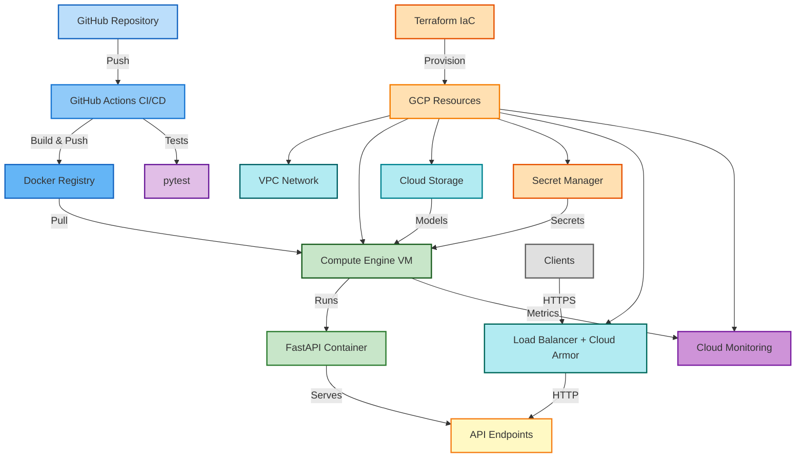

# 🚀 MLOps Core - Pipeline End-to-End

Automatisation complète du cycle de vie ML : Orchestration, CI/CD, et Observalité en production.

**Technologies** : Python, FastAPI, MLflow, DVC, Docker, Terraform, GCP  
**Statut** : ✅ Production Ready (v1.0.0)

## 📋 Vue d'ensemble

Ce projet couvre les piliers essentiels du MLOps :
- **🔄 Orchestration** : Infrastructure as Code (Terraform), déploiement automatisé
- **⚙️ CI/CD** : Pipeline GitHub Actions pour build/test/déploiement
- **📊 Observalité** : Monitoring Cloud Monitoring, logging structuré, Prometheus
- **🔬 Expérimentation** : MLflow pour le tracking des expériences ML
- **📦 Versioning** : DVC pour le versioning des données et reproductibilité

## ✨ Fonctionnalités

- 🔐 **Authentification** : API keys via Secret Manager GCP
- 🛡️ **Sécurité** : Rate limiting, firewall restrictif, headers de sécurité
- 🔒 **Chiffrement** : Support KMS pour Customer-Managed Encryption Keys
- ⚖️ **Load Balancer** : HTTP avec Cloud Armor (optionnel)
- 📊 **Monitoring** : Alertes Cloud Monitoring, métriques Prometheus
- 🚀 **Déploiement** : Infrastructure as Code avec Terraform
- 🐳 **Containerisation** : Docker multi-stage optimisé
- 📊 **MLflow** : Tracking complet des expériences ML
- 🔄 **DVC** : Versioning des données et pipeline reproductible

## 🏗️ Architecture



## 🚀 Démarrage rapide

### Prérequis

- Python 3.11+
- Docker & Docker Compose
- Terraform >= 1.0
- Google Cloud SDK (pour le déploiement)

### Installation locale

```bash
git clone https://github.com/mlarnes/mlops-core
cd mlops-core

make install    # Installation complète
make train      # Entraîner le modèle
make run        # Lancer l'API (http://localhost:8000)
```

### Déploiement GCP

Voir section [Déploiement Terraform](#-déploiement-terraform-gcp) ci-dessous.

## 📡 API Endpoints

| Endpoint | Méthode | Auth | Rate Limit | Description |
|----------|---------|------|------------|-------------|
| `/` | GET | ❌ | - | Informations API |
| `/health` | GET | ❌ | 30/min | Health check |
| `/metrics` | GET | ❌ | - | Métriques Prometheus |
| `/predict` | POST | ✅ | 10/min | Prédiction iris |
| `/model/info` | GET | ✅ | 20/min | Informations modèle |
| `/docs` | GET | ❌ | - | Documentation Swagger |

### Exemple d'utilisation

```bash
# Health check
curl http://localhost:8000/health

# Prédiction (avec API key)
curl -X POST "http://localhost:8000/predict" \
  -H "Content-Type: application/json" \
  -H "X-API-Key: your-api-key" \
  -d '{
    "sepal_length": 5.1,
    "sepal_width": 3.5,
    "petal_length": 1.4,
    "petal_width": 0.2
  }'
```

## ⚙️ Configuration

### Variables d'Environnement

| Variable | Description | Défaut | Production |
|----------|-------------|--------|------------|
| `ENVIRONMENT` | development/production | `development` | `production` |
| `API_KEY` | Clé API (`openssl rand -hex 32`) | - | **Requis** |
| `CORS_ORIGINS` | Origines autorisées (séparées par `,`) | `*` | **Spécifique** |
| `LOG_LEVEL` | DEBUG/INFO/WARNING/ERROR | `INFO` | `INFO` |
| `MODEL_DIR` | Répertoire des modèles | `models` | `models` |

**⚠️ CORS_ORIGINS** : Domaine du frontend qui appelle l'API. Exemple : `https://example.com`  
**Production** : Ne pas utiliser `*`

### Configuration du Modèle

Le projet utilise `params.yaml` pour la configuration du pipeline ML :

```yaml
data:
  test_size: 0.2
  random_state: 42

train:
  n_estimators: 100
  max_depth: null
  random_state: 42
```

## 🛠️ Commandes principales

```bash
# Développement
make install      # Installation complète
make train        # Entraîner le modèle
make test         # Exécuter les tests
make lint         # Vérifier la qualité du code
make format       # Formater le code
make run          # Lancer l'API (dev)
make build        # Build Docker

# MLflow
make mlflow-ui           # Interface MLflow (http://localhost:5000)

# DVC
make dvc-init      # Initialiser DVC
make dvc-repro     # Réexécuter le pipeline
make dvc-status    # Vérifier l'état
make dvc-push      # Pousser les données
make dvc-pull      # Télécharger les données

# Terraform
make terraform-init      # Initialiser
make terraform-plan      # Planifier
make terraform-apply     # Déployer
make terraform-destroy   # Détruire
make terraform-output    # Afficher les outputs

# Aide
make help          # Voir toutes les commandes
```

## 🧪 Expériences ML

### Approche Recommandée : DVC + MLflow

```bash
# Créer une expérience
cp params.yaml params-A.yaml
# Éditer params-A.yaml avec vos paramètres

# Lancer l'expérience
dvc repro --params params-A.yaml

# Comparer dans MLflow
make mlflow-ui
```

### Entraînement avec Paramètres Personnalisés

```bash
# Via CLI
poetry run python -m src.training.train \
  --n-estimators 200 \
  --max-depth 10 \
  --tag experiment_type baseline

# Via script
./scripts/run_trainings.sh
```

## 🏗️ Déploiement Terraform (GCP)

### 1. Prérequis

```bash
gcloud config set project YOUR_PROJECT_ID
gcloud auth application-default login
```

### 2. Backend GCS

```bash
# Créer le bucket pour le state Terraform
gcloud storage buckets create gs://YOUR_PROJECT_ID-terraform-state \
  --project=YOUR_PROJECT_ID --location=europe-west1

# Configurer backend
cd terraform
cp backend.tf.example backend.tf
# Éditer backend.tf avec vos valeurs
terraform init
```

### 3. Configuration

```bash
# Copier et éditer terraform.tfvars
cp terraform.tfvars.example terraform.tfvars

# Variables obligatoires :
# - project_id
# - allowed_ssh_ips (votre IP : curl ifconfig.me)
# - docker_image (image Docker de l'API)
# - bucket_name
```

### 4. Déploiement

```bash
# Générer et exporter l'API_KEY
export TF_VAR_api_key_value=$(openssl rand -hex 32)

# Valider et planifier
terraform validate
terraform plan

# Déployer
terraform apply
```

### 5. Uploader le Script de Déploiement

```bash
BUCKET_NAME=$(terraform output -raw bucket_name)
gcloud storage cp ../scripts/deploy-api.sh gs://$BUCKET_NAME/scripts/deploy-api.sh

# Redémarrer la VM
gcloud compute instances reset $(terraform output -raw vm_name) \
  --zone=$(terraform output -raw vm_zone)
```

### 6. Accès

```bash
# Récupérer l'IP et tester
terraform output vm_external_ip
curl http://$(terraform output -raw vm_external_ip):8000/health
```

**Fonctionnalités optionnelles** :
- Load Balancer avec Cloud Armor (`enable_load_balancer = true`)
- Chiffrement KMS (`enable_kms_encryption = true`)
- Monitoring avec alertes (`enable_monitoring_alerts = true`)

## 📦 DVC Remote (GCS)

```bash
# Créer le bucket
gcloud storage buckets create gs://YOUR_PROJECT_ID-dvc-cache \
  --project=YOUR_PROJECT_ID --location=europe-west1

# Configurer DVC
dvc remote add -d gcs gs://YOUR_PROJECT_ID-dvc-cache
export GOOGLE_APPLICATION_CREDENTIALS=/path/to/key.json

# Utiliser
dvc push    # Pousser les données
dvc pull    # Télécharger les données
```

## 🔒 Sécurité

- ✅ **Authentification** : API keys via Secret Manager
- ✅ **Rate limiting** : Protection contre abus (10-30 req/min selon endpoint)
- ✅ **HTTPS/TLS** : Certificats Let's Encrypt (production)
- ✅ **Scan de vulnérabilités** : Automatisé dans CI/CD
- ✅ **Firewall** : Deny by default, accès restreint par IP
- ✅ **IAM** : Principe du moindre privilège
- ✅ **Secrets** : Aucun secret hardcodé, gestion via Secret Manager
- ✅ **Chiffrement** : Support KMS pour Customer-Managed Encryption Keys
- ✅ **Load Balancer** : Cloud Armor pour protection DDoS (optionnel)
- ✅ **Logging structuré** : Logs JSON pour audit
- ✅ **Monitoring** : Alertes Cloud Monitoring activées
- ✅ **Métriques** : Prometheus pour observabilité

## 🔍 Troubleshooting

### L'API ne démarre pas

```bash
ls models/iris_model.pkl              # Vérifier le modèle
docker-compose logs iris-api          # Vérifier les logs
docker-compose config                 # Vérifier les variables
```

### Erreur CORS en production

```bash
echo $CORS_ORIGINS                    # Vérifier CORS_ORIGINS
export CORS_ORIGINS=https://example.com  # Ne pas utiliser "*"
```

### Terraform échoue

```bash
gcloud auth application-default login  # Vérifier credentials
gcloud config get-value project       # Vérifier le projet
gcloud projects get-iam-policy YOUR_PROJECT_ID  # Vérifier permissions
```

## 🏗️ Structure du projet

```
mlops-core/
├── src/                    # Code source
│   ├── config.py         # Configuration centralisée (Pydantic)
│   ├── data/             # Préparation des données
│   ├── training/          # Entraînement des modèles
│   ├── evaluation/        # Évaluation des modèles
│   └── serving/           # API de prédiction (FastAPI)
├── tests/                  # Tests unitaires
├── scripts/                # Scripts utilitaires & déploiement
├── terraform/              # Infrastructure as Code
├── docs/                   # Documentation détaillée
├── data/                   # Données versionnées (DVC)
│   ├── raw/               # Dataset brut
│   └── processed/         # Données traitées
├── models/                 # Modèles ML (gitignored)
├── mlruns/                 # MLflow tracking (gitignored)
├── params.yaml            # Paramètres du pipeline (DVC)
└── dvc.yaml               # Pipeline DVC
```

## 🔗 Ressources

### Documentation
- [Documentation API](http://localhost:8000/docs) - Swagger UI interactive
- [Semaine 1](./docs/SEMAINE_1.md) - Introduction et setup
- [Semaine 2](./docs/SEMAINE_2.md) - Pipeline ML et entraînement
- [Semaine 3 - Déploiement](./docs/SEMAINE_3.md) - Guide de déploiement complet
- [Semaine 4 - MLflow & DVC](./docs/SEMAINE_4.md) - Guide MLflow & DVC

### Technologies
- [FastAPI Documentation](https://fastapi.tiangolo.com/)
- [Terraform GCP Provider](https://registry.terraform.io/providers/hashicorp/google/latest)
- [MLflow Documentation](https://mlflow.org/docs/latest/index.html)
- [DVC Documentation](https://dvc.org/doc)

## 📝 Licence

Formation MLOps - Projet éducatif

---

**Status** : ✅ Production-ready | **Version** : 1.0.0
