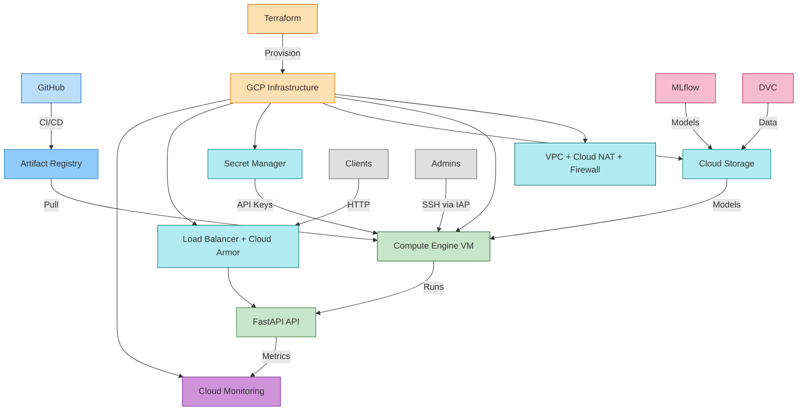

# 🚀 MLOps Core - Pipeline End-to-End

> Cycle de vie ML automatisé : CI/CD, orchestration et observabilité en production.

[](https://www.python.org/)
[](https://fastapi.tiangolo.com/)
[](LICENSE)
[]()

**Version** : 1.0.0

### Technologies utilisées

| Domaine | Technologies |
|--------|---------------|
| **Backend & API** | Python 3.11, FastAPI, Uvicorn, Pydantic |
| **ML & Données** | scikit-learn, pandas, numpy, MLflow, DVC |
| **DevOps & Infra** | Docker, Docker Compose, Kubernetes (minikube/kind), Terraform, GCP, GitHub Actions |
| **Observabilité** | Prometheus, Grafana, AlertManager, prometheus-client |
| **Qualité & Tests** | Poetry, pytest, Black, isort, Flake8 |
| **Sécurité** | SlowAPI (rate limiting), Secret Manager GCP |

---

## 📑 Table des matières

- [🚀 Quick Start](#-quick-start)
- [📋 Vue d'ensemble](#-vue-densemble)
- [✨ Fonctionnalités](#-fonctionnalités)
- [📚 Documentation détaillée](#-documentation-détaillée)
- [🏗️ Parcours](#-parcours)
- [📦 Installation](#-installation)
- [1. En local](#1-en-local)
- [2. Cluster Kubernetes](#2-cluster-kubernetes)
- [3. Déploiement GCP (cloud)](#3-déploiement-gcp-cloud)
- [📡 API Endpoints](#-api-endpoints)
- [⚙️ Configuration](#️-configuration)
- [🛠️ Commandes](#️-commandes)
- [🔒 Sécurité](#-sécurité)
- [🔍 Troubleshooting](#-troubleshooting)
- [📚 Documentation](#-documentation)
- [🏗️ Structure du projet](#structure-du-projet)

---

## 🚀 Quick Start

```bash
# Cloner et installer
git clone https://github.com/mlarnes/mlops-core
cd mlops-core
make install

# Entraîner le modèle
make train

# Lancer l'API (dans un terminal)
make run

# Tester (dans un autre terminal)
curl http://localhost:8000/health
```

> **💡 Documentation interactive** : http://localhost:8000/docs

---

## 📋 Vue d'ensemble

Ce projet implémente un **cycle MLOps complet** :

1. **Serving & Containerisation** — API FastAPI + Docker
2. **CI/CD** — GitHub Actions, build et push d’images
3. **Infrastructure** — Terraform, GCP (VPC, VM, Storage, Secret Manager)
4. **Expérimentation** — MLflow, DVC, reproductibilité
5. **Orchestration** — Kubernetes, HPA, workflows MLflow
6. **Observabilité** — Prometheus, Grafana, AlertManager

Chaque thème est documenté en détail dans [docs/](docs/README.md) (objectifs, tutoriels, bonnes pratiques).

## ✨ Fonctionnalités

- 🔐 **Authentification** : API keys via Secret Manager GCP
- 🛡️ **Sécurité** : Rate limiting, firewall restrictif, headers de sécurité
- 🔒 **Chiffrement** : Support KMS pour Customer-Managed Encryption Keys
- ⚖️ **Load Balancer** : HTTP avec Cloud Armor (optionnel)
- 📊 **Monitoring** : Alertes Cloud Monitoring, métriques Prometheus
- 🚀 **Déploiement** : Infrastructure as Code avec Terraform
- 🐳 **Containerisation** : Docker multi-stage optimisé
- ☸️ **Orchestration** : Kubernetes avec auto-scaling (HPA) et haute disponibilité
- 📊 **MLflow** : Tracking complet des expériences ML
- 🔄 **DVC** : Versioning des données et pipeline reproductible

## 📚 Documentation détaillée

Chaque thème est documenté dans `docs/` (objectifs, tutoriels, bonnes pratiques).

| Thème | Focus | Technologies | Documentation |
|------|--------|--------------|---------------|
| **Serving & Containerisation** | API + Docker | FastAPI, Docker, pytest | [détails](docs/serving-containerisation.md) |
| **CI/CD** | Automatisation | GitHub Actions, Artifact Registry | [détails](docs/cicd.md) |
| **Infrastructure** | IaC GCP | Terraform, GCP | [détails](docs/infrastructure.md) |
| **Expérimentation** | Tracking & versioning | MLflow, DVC | [détails](docs/experimentation.md) |
| **Orchestration** | K8s | Kubernetes, HPA | [détails](docs/orchestration.md) |
| **Observabilité** | Monitoring | Prometheus, Grafana, AlertManager | [détails](docs/observability.md) |

## 🏗️ Parcours

- **1. En local** : développement pur (Poetry, `make train`, `make run`) ou avec Docker Compose.
- **2. Cluster Kubernetes** : minikube/kind, API + MLflow dans le cluster, Job d’entraînement.
- **3. Cloud (GCP)** : Terraform, VM, Load Balancer, Secret Manager — voir le schéma détaillé dans la section [3. Déploiement GCP](#3-déploiement-gcp-cloud).

## 📦 Installation

### Prérequis

| Outil | Version |
|-------|---------|
| **Python** | 3.11+ |
| **Docker** | >= 20.10 |
| **Docker Compose** | >= 2.0 |
| **Terraform** | >= 1.0 |
| **Google Cloud SDK** | >= 400.0 |
| **Poetry** | >= 1.7.0 |
| **kubectl** | >= 1.28 (optionnel, pour Kubernetes) |
| **minikube** ou **kind** | >= 1.30 / >= 0.20 (optionnel, pour Kubernetes local) |

### Installation Locale

```bash
git clone https://github.com/mlarnes/mlops-core
cd mlops-core
make install
```

> **Note** : L'installation configure automatiquement Poetry et installe toutes les dépendances.

---

## 1. En local

Développement sur la machine (Poetry, pas de cluster). Option : lancer l’API avec Docker Compose.

### Entraîner le modèle

```bash
# Entraîner avec les paramètres par défaut
make train

# Ou exécuter le pipeline DVC complet
make dvc-repro

# Visualiser les résultats dans MLflow
make mlflow-ui  # http://localhost:5000
```

#### Expérimenter avec différents paramètres

```bash
# Option 1 : Modifier params.yaml puis réexécuter
make dvc-repro

# Option 2 : Surcharger directement (sans modifier params.yaml)
poetry run dvc exp run -S train.n_estimators=200 -S train.max_depth=10

# Visualiser et comparer dans MLflow
make mlflow-ui  # http://localhost:5000
```

### Lancer l’API (processus local)

```bash
make run
# Dans un autre terminal :
curl http://localhost:8000/health
curl -X POST "http://localhost:8000/predict" \
  -H "Content-Type: application/json" -H "X-API-Key: your-api-key" \
  -d '{"sepal_length": 5.1, "sepal_width": 3.5, "petal_length": 1.4, "petal_width": 0.2}'
```

> **💡 Astuce** : Documentation interactive sur http://localhost:8000/docs

### Option : API avec Docker Compose

```bash
make train
docker compose up
# API sur http://localhost:8000 (montage mlruns/ automatique)
```

---

## 2. Cluster Kubernetes

Cluster local (minikube ou kind) : API + MLflow dans le cluster, entraînement via Job Kubernetes.

**Prérequis** : `kubectl`, cluster (minikube/kind). Préparer les secrets : `cp k8s/secret.yaml.example k8s/secret.yaml` puis éditer.

| Workflow | Commandes |
|----------|-----------|
| **Avec MLflow** (recommandé) | `make k8s-setup` (ou `make k8s-setup-kind`) → `make k8s-deploy-mlflow` → `kubectl apply -f k8s/train-job.yaml` puis `kubectl rollout restart deployment/iris-api -n mlops` → `make k8s-port-forward` / `make k8s-mlflow-ui` |
| **API seule** (MLflow local) | `minikube mount $(pwd)/mlruns:/tmp/mlruns` (terminal séparé) → `make k8s-deploy` → `make k8s-port-forward` |

Tests : `make k8s-test` · Logs : `make k8s-logs`

> **Guide détaillé** : [k8s/README.md](k8s/README.md) · [docs/orchestration.md](docs/orchestration.md)

---

## 3. Déploiement GCP (cloud)

Infrastructure GCP avec Terraform (VPC, VM, Storage, Secret Manager, Load Balancer). L’API tourne sur une VM ou peut être déployée sur GKE.

**Prérequis** : `gcloud` configuré, APIs activées (compute, storage, iam, secretmanager, artifactregistry, monitoring, logging, iap).

### Étapes

1. **Build & push** : `docker build --platform linux/amd64 -t $DOCKER_IMAGE_URI .` puis `docker push $DOCKER_IMAGE_URI` (voir [terraform/README.md](terraform/README.md) pour l’URI).
2. **Terraform** : `cp terraform/backend.tf.example terraform/backend.tf` et `cp terraform/terraform.tfvars.example terraform/terraform.tfvars`, éditer `terraform.tfvars`, puis `make terraform-init` → `make terraform-plan` → `make terraform-apply`.
3. **Modèle** : `gcloud storage cp -r mlruns/ gs://$(terraform -chdir=terraform output -raw bucket_name)/`
4. **Démarrer l’API** : SSH via IAP sur la VM, `sudo systemctl start mlops-api`.

### Architecture GCP



**Composants** : GitHub Actions → Artifact Registry → GCP (VPC, VM, Storage, Secret Manager, Load Balancer) → FastAPI | MLflow/DVC → Cloud Storage | Monitoring

> **Guide détaillé** : [terraform/README.md](terraform/README.md) · [docs/infrastructure.md](docs/infrastructure.md)

---

## 📡 API Endpoints

| Endpoint | Méthode | Auth | Rate Limit | Description |
|----------|---------|------|------------|-------------|
| `/` | GET | ❌ | - | Informations API |
| `/health` | GET | ❌ | 30/min | Health check |
| `/metrics` | GET | ❌ | - | Métriques Prometheus |
| `/predict` | POST | ✅ | 10/min | Prédiction iris |
| `/model/info` | GET | ✅ | 20/min | Informations modèle |
| `/docs` | GET | ❌ | - | Documentation Swagger |

## ⚙️ Configuration

### Variables d'Environnement

| Variable | Description | Défaut | Production |
|----------|-------------|--------|------------|
| `ENVIRONMENT` | `development` / `production` | `development` | `production` |
| `API_KEY` | Clé API (générer avec `openssl rand -hex 32`) | - | **Requis** |
| `CORS_ORIGINS` | Origines autorisées (séparées par `,`) | `*` (dev uniquement) | **Spécifique, jamais `*`** |
| `LOG_LEVEL` | `DEBUG` / `INFO` / `WARNING` / `ERROR` | `INFO` | `INFO` |
| `MODEL_DIR` | Répertoire des modèles | `models` | `models` |
| `MLFLOW_TRACKING_URI` | URI MLflow (GCS ou serveur) | - | `gs://bucket/mlruns/` |

> **⚠️ Sécurité** : En production, `CORS_ORIGINS` doit être spécifique (ex: `https://example.com`).  
> L'application refusera de démarrer si `ENVIRONMENT=production` et que `CORS_ORIGINS` est vide ou contient `*` (protection volontaire contre un CORS trop permissif).

### Configuration du Modèle

Le pipeline ML est configuré via `params.yaml` :

```yaml
data:
  test_size: 0.2
  random_state: 42

train:
  n_estimators: 200
  max_depth: 10
```

> **💡 Astuce** : Modifier ces valeurs puis exécuter `make dvc-repro` pour réentraîner le modèle avec les nouveaux paramètres.

## 🛠️ Commandes

### Développement

| Commande | Description |
|----------|-------------|
| `make install` | Installation complète (Poetry + dépendances) |
| `make train` | Entraîner le modèle ML |
| `make test` | Exécuter tous les tests |
| `make lint` | Vérifier la qualité du code |
| `make format` | Formater le code (Black + isort) |
| `make run` | Lancer l'API en développement |
| `make build` | Construire l'image Docker |

### MLflow & DVC

| Commande | Description |
|----------|-------------|
| `make mlflow-ui` | Lancer l'interface MLflow (http://localhost:5000) |
| `make dvc-init` | Initialiser DVC |
| `make dvc-repro` | Réexécuter le pipeline DVC |
| `make dvc-status` | Vérifier l'état du pipeline |
| `make dvc-pipeline` | Afficher le graphe du pipeline DVC |
| `make dvc-push` | Pousser les données versionnées |
| `make dvc-pull` | Télécharger les données versionnées |

### Terraform

| Commande | Description |
|----------|-------------|
| `make terraform-init` | Initialiser Terraform |
| `make terraform-validate` | Valider la configuration |
| `make terraform-plan` | Planifier les changements |
| `make terraform-apply` | Déployer l'infrastructure |
| `make terraform-destroy` | Détruire l'infrastructure |
| `make terraform-output` | Afficher les outputs |
| `make terraform-refresh` | Rafraîchir l'état |

### Kubernetes

| Commande | Description |
|----------|-------------|
| `make k8s-setup` | Installer minikube et créer le cluster |
| `make k8s-setup-kind` | Installer kind et créer le cluster |
| `make k8s-deploy` | Déployer l'API sur Kubernetes |
| `make k8s-deploy-mlflow` | Déployer API + MLflow server (recommandé) |
| `make k8s-status` | Vérifier le statut du déploiement |
| `make k8s-logs` | Voir les logs des pods |
| `make k8s-port-forward` | Port-forward vers l'API |
| `make k8s-mlflow-ui` | Port-forward vers MLflow UI |
| `make k8s-test` | Tester l'API déployée |
| `make k8s-delete` | Supprimer le déploiement |
| `make k8s-clean` | Nettoyer complètement |
| `make k8s-monitoring-deploy` | Déployer Prometheus, Grafana, AlertManager |
| `make k8s-monitoring-status` | Vérifier le statut de la stack de monitoring |
| `make k8s-monitoring-logs` | Afficher les logs Prometheus |
| `make k8s-monitoring-logs-grafana` | Afficher les logs Grafana |
| `make k8s-monitoring-port-forward` | Accéder aux UIs monitoring |
| `make k8s-monitoring-delete` | Supprimer la stack de monitoring |

### Aide

```bash
make help  # Liste complète des commandes disponibles
```

> **💡 Astuce** : Toutes les commandes `make` peuvent être exécutées depuis la racine du projet.

## 📦 Configuration Avancée

### DVC Remote (GCS)

Pour versionner les données dans Google Cloud Storage :

```bash
# Créer le bucket DVC (si PROJECT_ID est défini)
gcloud storage buckets create gs://$PROJECT_ID-dvc-cache \
  --project=$PROJECT_ID --location=europe-west1 || true

# Configurer DVC
dvc remote add -d gcs gs://$PROJECT_ID-dvc-cache
export GOOGLE_APPLICATION_CREDENTIALS=/path/to/key.json

# Utilisation
make dvc-push    # Pousser les données
make dvc-pull    # Télécharger les données
```

## 🔒 Sécurité

### Authentification & Autorisation
- ✅ **API Keys** : Authentification via Secret Manager GCP
- ✅ **IAM** : Principe du moindre privilège
- ✅ **Secrets** : Aucun secret hardcodé, gestion centralisée via Secret Manager

### Protection
- ✅ **Rate Limiting** : Protection contre abus (10-30 req/min selon endpoint)
- ✅ **Firewall** : Deny by default, accès restreint par IP
- ✅ **Cloud NAT** : Accès Internet sortant uniquement (unidirectionnel) - n'expose pas la VM aux connexions entrantes
- ✅ **HTTPS/TLS** : Certificats Let's Encrypt (production)
- ✅ **Load Balancer** : Cloud Armor pour protection DDoS (optionnel)

### Observabilité & Conformité
- ✅ **Logging structuré** : Logs JSON pour audit
- ✅ **Monitoring** : Alertes Cloud Monitoring activées
- ✅ **Métriques** : Prometheus pour observabilité (déployé sur K8s)
- ✅ **Visualisation** : Grafana avec dashboards pré-configurés
- ✅ **Alertes** : AlertManager avec 6 règles d'alerte actives
- ✅ **Scan de vulnérabilités** : Automatisé dans CI/CD

### Chiffrement
- ✅ **KMS** : Support Customer-Managed Encryption Keys

## 🔍 Troubleshooting

**Vérifications rapides** : `curl …/health` ; logs (`docker compose logs iris-api` / `journalctl -u mlops-api` / `kubectl logs -n mlops`) ; `models/metadata.json` avec `mlflow_run_id` ; variables d’environnement (API_KEY, MLFLOW_TRACKING_URI).

**Checklist** : auth GCP, projet, APIs activées, IAM, modèle entraîné, upload GCS, CORS (jamais `*` en prod).

> **Guide détaillé** : [docs/infrastructure.md](docs/infrastructure.md) (GCP/VM) | [k8s/README.md](k8s/README.md) (K8s)

## 🏗️ Structure du projet

```
mlops-core/
├── src/                    # Code source Python
│   ├── config.py          # Configuration centralisée (Pydantic)
│   ├── data/              # Préparation des données
│   │   └── prepare.py
│   ├── training/          # Entraînement des modèles
│   │   └── train.py
│   ├── evaluation/        # Évaluation des modèles
│   │   └── evaluate.py
│   └── serving/           # API de prédiction (FastAPI)
│       ├── app.py         # Application principale
│       ├── lifespan.py    # Chargement/déchargement du modèle
│       ├── routes.py      # Endpoints API
│       ├── models.py      # Modèles Pydantic
│       ├── metrics.py     # Métriques Prometheus
│       ├── middleware.py  # Middleware (rate limiting, etc.)
│       └── security.py    # Authentification
├── tests/                  # Tests unitaires (pytest)
├── scripts/                # Scripts utilitaires & déploiement
├── terraform/              # Infrastructure as Code (GCP)
├── k8s/                    # Manifests Kubernetes
│   ├── namespace.yaml     # Namespace
│   ├── deployment.yaml    # Deployment API
│   ├── mlflow-deployment.yaml # Deployment MLflow server
│   ├── mlflow-pvc.yaml    # PVC MLflow
│   ├── models-pvc.yaml    # PVC modèles
│   ├── service.yaml       # Service API
│   ├── mlflow-service.yaml # Service MLflow
│   ├── service-nodeport.yaml # Service NodePort (dev/test)
│   ├── configmap.yaml     # ConfigMap
│   ├── secret.yaml.example # Template Secret
│   ├── ingress.yaml       # Ingress (optionnel)
│   ├── hpa.yaml           # HPA (optionnel)
│   ├── train-job.yaml     # Job d'entraînement
│   └── monitoring/        # Stack observabilité
│       ├── prometheus-*.yaml
│       ├── grafana-*.yaml
│       ├── alertmanager-*.yaml
│       └── servicemonitor-iris-api.yaml
├── docs/                   # Documentation détaillée
├── data/                   # Données versionnées (DVC)
│   ├── raw/               # Dataset brut
│   └── processed/         # Données traitées
├── models/                 # Métadonnées du modèle
│   ├── metadata.json      # Métadonnées (inclut mlflow_run_id)
│   └── metrics.json       # Métriques d'évaluation
├── mlruns/                 # MLflow tracking (gitignored)
├── params.yaml            # Paramètres du pipeline (DVC)
├── dvc.yaml               # Pipeline DVC
├── pyproject.toml         # Configuration Poetry
├── Dockerfile             # Image Docker
└── docker-compose.yml     # Configuration Docker Compose
```

## 📚 Documentation

| Ressource | Description |
|-----------|-------------|
| [docs/README.md](docs/README.md) | Vue d’ensemble par thème (documentation détaillée) |
| [terraform/README.md](terraform/README.md) | Déploiement GCP |
| [k8s/README.md](k8s/README.md) | Déploiement Kubernetes (workflows MLflow / API seule) |
| [k8s/monitoring/README.md](k8s/monitoring/README.md) | Stack Prometheus / Grafana / AlertManager |

[Serving](docs/serving-containerisation.md) · [CI/CD](docs/cicd.md) · [Infrastructure](docs/infrastructure.md) · [Expérimentation](docs/experimentation.md) · [Orchestration](docs/orchestration.md) · [Observabilité](docs/observability.md)

### Documentation API

- **Swagger UI** : http://localhost:8000/docs (en développement)
- **ReDoc** : http://localhost:8000/redoc

### Ressources externes

| Technologie | Documentation |
|-------------|---------------|
| **FastAPI** | [fastapi.tiangolo.com](https://fastapi.tiangolo.com/) |
| **Python** | [python.org](https://www.python.org/doc/) |
| **scikit-learn** | [scikit-learn.org](https://scikit-learn.org/stable/) |
| **Poetry** | [python-poetry.org](https://python-poetry.org/docs/) |
| **Docker** | [docs.docker.com](https://docs.docker.com/) |
| **Kubernetes** | [kubernetes.io](https://kubernetes.io/docs/) |
| **Terraform GCP** | [registry.terraform.io](https://registry.terraform.io/providers/hashicorp/google/latest) |
| **MLflow** | [mlflow.org](https://mlflow.org/docs/latest/index.html) |
| **DVC** | [dvc.org](https://dvc.org/doc) |
| **Prometheus** | [prometheus.io](https://prometheus.io/docs/) |
| **Grafana** | [grafana.com/docs](https://grafana.com/docs/) |
| **Alertmanager** | [prometheus.io/docs/alerting](https://prometheus.io/docs/alerting/latest/alertmanager/) |
| **GitHub Actions** | [docs.github.com/actions](https://docs.github.com/en/actions) |
| **Google Cloud** | [cloud.google.com/docs](https://cloud.google.com/docs) |

---

## 📝 Licence

Educational use.

---

<div align="center">

**Status** : ✅ Production-ready | **Version** : 1.0.0

</div>

